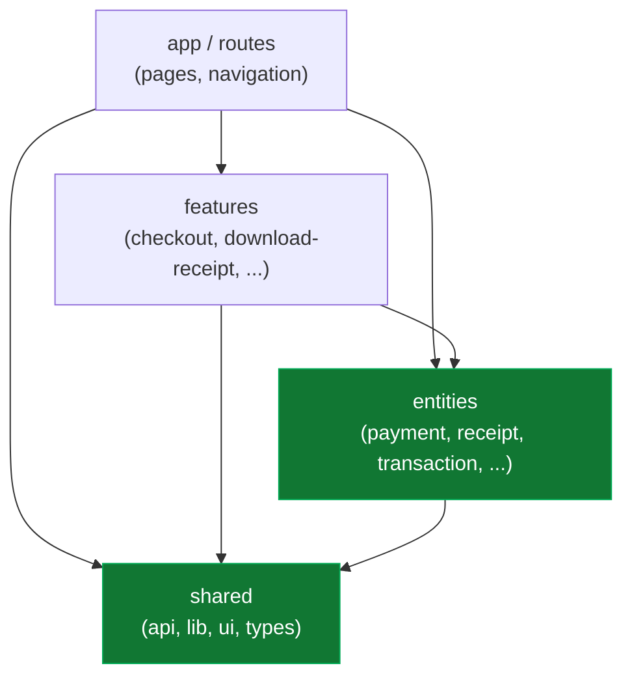
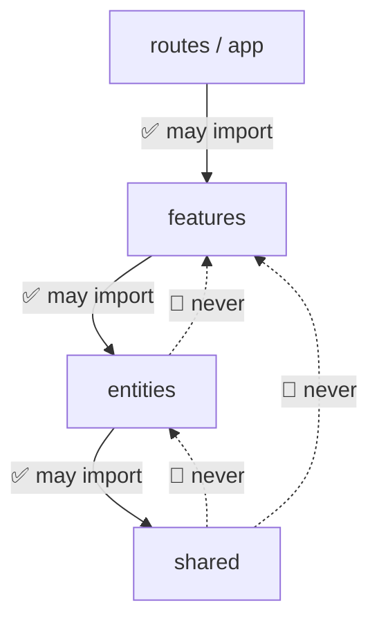
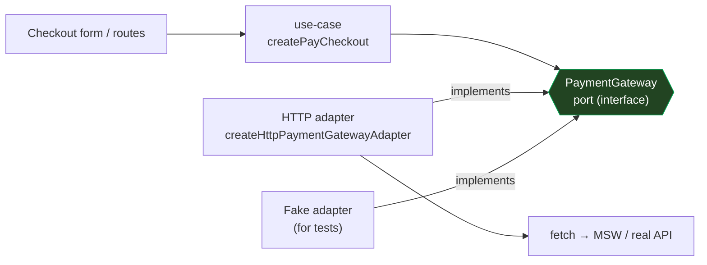
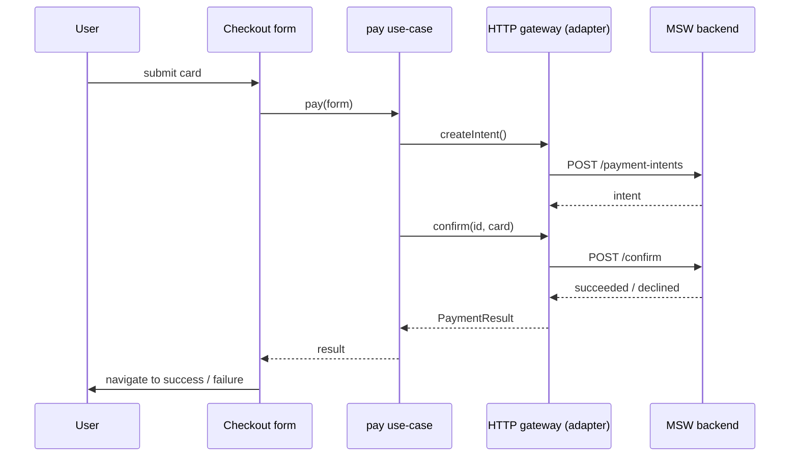
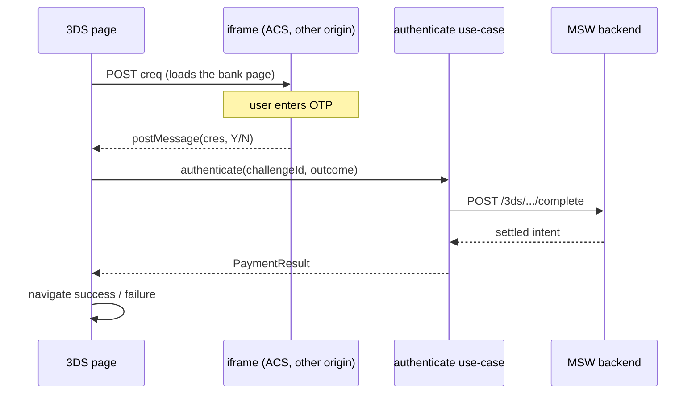
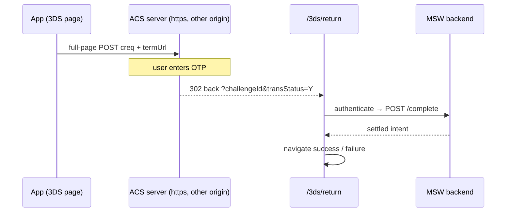
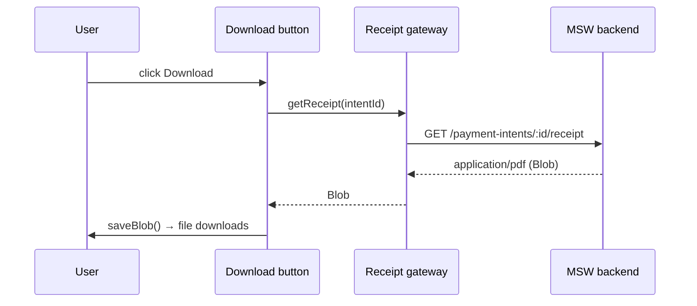

# Architecture

> Русская версия: [architecture.ru.md](./architecture.ru.md)

This project is a payment checkout UI. It looks small, but it touches the things
that make front-end apps hard over time: network calls, a bank redirect (3-D
Secure), file downloads, and rules about money. So it is built with a clear shape
that keeps those messy details at the edges and the important logic in the middle.

This document explains that shape - **why** it exists and **how** the pieces fit -
in plain language.

---

## The one idea

> The important logic sits in the center and depends on **nothing** outside it.
> The messy details - React, `fetch`, the router, the mock server - live at the
> edges and are **swappable**.

Everything else here is a consequence of that sentence. We draw it as arrows that
only ever point **inward**: outer things know about inner things, never the
reverse.



**The rule:** imports only go **down** this picture. `features` may use `entities`;
`entities` may use `shared`. Going **up** is forbidden - an `entity` must never
import from a `feature`. That single rule is what keeps the core reusable and
testable. (This is exactly the folder taxonomy of **Feature-Sliced Design**.)



---

## The layers, in words

| Folder | What lives here | Analogy |
| --- | --- | --- |
| `shared/` | tiny generic tools: `http-client`, `saveBlob`, UI kit, base types | the toolbox |
| `entities/` | the nouns of the domain: a payment, a receipt - their types + the **ports** to reach them | the vocabulary |
| `features/` | the verbs / scenarios: "pay", "authenticate 3DS", "download receipt" | the actions |
| `app/`, `routes/` | pages, wiring, navigation - the actual screens | the building |
| `src/mocks/` | a fake payment backend (MSW) so the app runs with no real server | the practice dummy |
| `acs/` | a standalone 3-D Secure "bank" server for realistic redirect/iframe tests | the sparring partner |

---

## Ports and adapters

The center never calls `fetch` directly. Instead it depends on a **port** - a
plain TypeScript interface that says *what* can be done ("create a payment",
"confirm a card") without saying *how*. A concrete **adapter** implements the port
and does the real HTTP.



Why this is worth the extra file:

- **Swap the transport, keep everything else.** Move from `fetch` to `axios`, or
  from the mock to a real Stripe backend - you write one new adapter. The
  use-case, the pages, and the domain do not change.
- **Test the logic without a network.** Pass a fake adapter that returns canned
  answers; the use-case runs in a plain unit test, no browser, no server.
- **The server's data shape stays at the edge.** The backend's wire format (its
  DTO) is translated to our own domain type **inside the adapter**, so weird
  field names never spread across the app.

Ports in this repo:

- `PaymentGateway` - `src/entities/payment/api/payment-gateway.ts`
- `ReceiptGateway` - `src/entities/receipt/api/receipt-gateway.ts`

Their HTTP adapters sit next to them as `*.adapter.ts`.

---

## How a request flows

### Paying (no 3-D Secure)



The use-case returns a `PaymentResult` - a simple value describing *what
happened* (`succeeded` / `requires_action` / `declined` / `error`). It does not
navigate and does not touch the network. The page decides where to go from the
result.

### 3-D Secure - iframe mode

The bank's page lives in a small frame inside ours. When the user finishes, the
bank sends the verdict back with `postMessage`.



### 3-D Secure - redirect mode (like Santander)

The whole page goes to the bank; the bank sends the browser **back** to a return
URL. Because a full reload wipes memory, everything needed rides in the URL.



A key safety rule in both modes: the `postMessage` / redirect is only a **hint**.
The real status always comes from the backend (`authenticate` re-checks it). A
message can be faked; a backend answer cannot.

### Downloading the receipt



The receipt is an opaque PDF the server issues; the front end just downloads it.
`saveBlob` (`src/shared/lib/save-blob.ts`) is the only piece that touches the DOM
to trigger the download.

---

## Why bother - and when it's overkill

**You get:**

- one place to change when the backend changes (the adapter),
- a core you can unit-test with no browser and no network,
- the freedom to swap the mock for a real provider without rewriting screens,
- no leakage of server field names into UI code.

**The cost:**

- more files and one extra hop (UI → use-case → port → adapter),
- for a tiny throwaway screen this is too much ceremony.

Rule of thumb: use it where the logic is real and long-lived (payments, auth).
For a static "about" page, don't.

---

## Three names for one idea

The design borrows from three well-known approaches. They do **not** compete here -
they describe different zoom levels of the same picture.

| Approach | One line | What it contributes here |
| --- | --- | --- |
| **[Hexagonal (Ports & Adapters)](https://alistair.cockburn.us/hexagonal-architecture/)** | app in the center, interfaces on the edges, plug in adapters | the `*Gateway` ports + `*.adapter.ts` |
| **[Clean Architecture](https://blog.cleancoder.com/uncle-bob/2012/08/13/the-clean-architecture.html)** | concentric rings; dependencies point inward only | the "arrows go down" rule + the use-case ring |
| **[Feature-Sliced Design (FSD)](https://feature-sliced.design/)** | a concrete folder taxonomy for front-end | the `app / features / entities / shared` layout |

Short version: **Hexagonal** is about the *edges* (how the core talks to the
world). **Clean** adds the *inner rings* and the strict dependency rule. **FSD**
is the *folder map* that makes all of it navigable in a React project.

Analogy: a wall socket (**port**) is a fixed contract; any plug (**adapter**) that
fits works, and the house doesn't care what's plugged in - that's Hexagonal. Clean
adds the rule "wiring in the walls, sockets at the edges, panel in the middle."
FSD is the floor plan that says which room each thing goes in.

---

## Where things live

```
src/
  app/           app setup, providers, mocking switch
  routes/        pages + navigation (incl. 3ds/challenge, 3ds/return, summary/*)
  features/
    checkout/
      model/     pay.usecase.ts, authenticate-3ds.usecase.ts   (scenarios)
      ui/        checkout-form.tsx, three-ds-challenge.tsx
    download-receipt/
      model/     generate-receipt.usecase.ts
  entities/
    payment/
      api/       payment-gateway.ts (PORT), http-payment-gateway.adapter.ts
      model/     types.ts (PaymentResult, PaymentIntent, ...)
    receipt/
      api/       receipt-gateway.ts (PORT), http-receipt-gateway.adapter.ts
  shared/
    api/         http-client.ts (fetch wrapper: get/post/getBlob)
    lib/         save-blob.ts, formatting, branded types
src/mocks/       MSW fake backend (see src/mocks/README.md)
acs/             3-D Secure ACS simulator (see acs/README.md)
```

---

## Further reading

Architecture ideas (the "why"):

- [Clean Architecture - Robert C. Martin](https://blog.cleancoder.com/uncle-bob/2012/08/13/the-clean-architecture.html)
- [Hexagonal Architecture (Ports & Adapters) - Alistair Cockburn](https://alistair.cockburn.us/hexagonal-architecture/)
- [Feature-Sliced Design - official docs](https://feature-sliced.design/)
- [Dependency Inversion Principle - Wikipedia](https://en.wikipedia.org/wiki/Dependency_inversion_principle)

The stack used here (the "how"):

- [Mock Service Worker (MSW)](https://mswjs.io/) - the fake backend
- [TanStack Router](https://tanstack.com/router/latest) - typed routing and search params
- [Zustand](https://zustand.docs.pmnd.rs/) - the store
- [React Hook Form](https://react-hook-form.com/) + [Zod](https://zod.dev/) - form state and validation

The web platform behind 3-D Secure (the security details):

- [3-D Secure - Wikipedia](https://en.wikipedia.org/wiki/3-D_Secure)
- [Stripe: 3D Secure authentication](https://docs.stripe.com/payments/3d-secure)
- [MDN: iframe `sandbox`](https://developer.mozilla.org/en-US/docs/Web/HTML/Element/iframe#sandbox)
- [MDN: CSP `frame-ancestors`](https://developer.mozilla.org/en-US/docs/Web/HTTP/Headers/Content-Security-Policy/frame-ancestors)
- [MDN: `SameSite` cookies](https://developer.mozilla.org/en-US/docs/Web/HTTP/Headers/Set-Cookie/SameSite)
- [MDN: `window.postMessage`](https://developer.mozilla.org/en-US/docs/Web/API/Window/postMessage)
- [MDN: same-origin policy](https://developer.mozilla.org/en-US/docs/Web/Security/Same-origin_policy)

---

## Glossary

- **Port** - an interface describing *what* can be done, with no implementation.
- **Adapter** - a concrete class/function implementing a port (the real HTTP, or a
  fake for tests).
- **Use-case** - one application scenario ("pay", "authenticate"); orchestrates
  ports, contains no UI and no `fetch`.
- **DTO** - the data shape the server sends over the wire; translated to our domain
  type inside the adapter.
- **Domain type** - how *our* app describes a thing (e.g. `PaymentResult`),
  independent of the server.
- **Composition root** - the single spot where a concrete adapter is created and
  injected into a use-case (here: the routes/store).
- **Dependency rule** - imports point inward/down only; the core never imports the
  outer layers.
