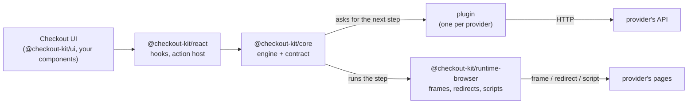
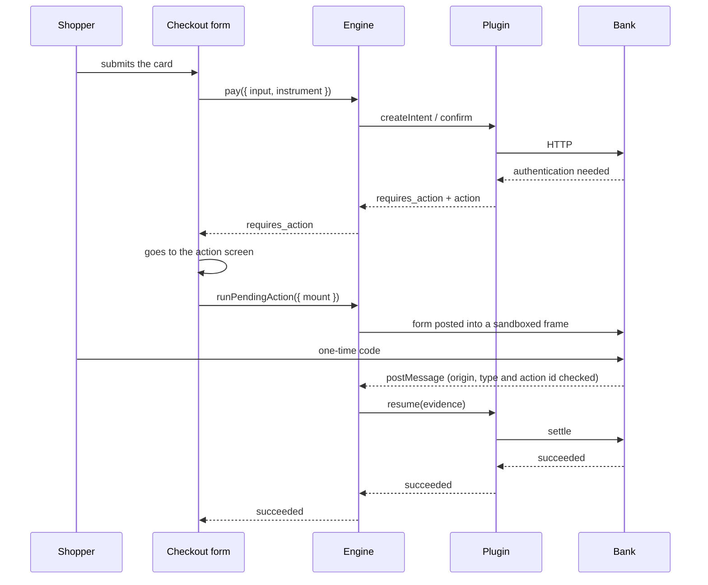
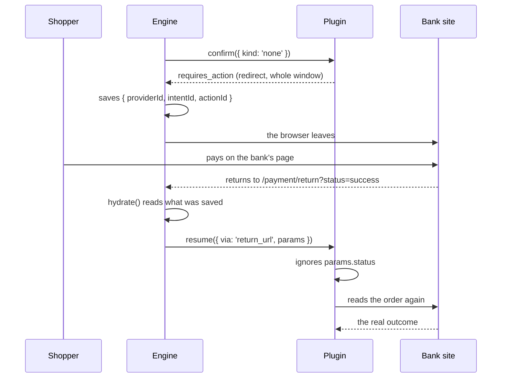

# Architecture

> Русская версия: [architecture.ru.md](./architecture.ru.md)

## The idea

A checkout holds two kinds of knowledge, and they change at very different speeds.

The first is what a payment is. It is created. An instrument is presented. Sometimes another
step is needed before it can settle. In the end it succeeded, was declined, or failed. This
has been true for decades.

The second is how one provider describes all of that. JSON or form-encoded. A status as a
word or as a number. An error in the HTTP status code, or inside a successful response. A
challenge in a frame, a redirect to the bank's page, fields the provider renders itself, a
wallet on the phone. This part changes often and differs between providers. It is why
"add a second payment provider" usually means rewriting a checkout.

So the two are kept apart. The first lives in `@checkout-kit/core` and is written once. The second
lives in plugins, one per provider, and the core cannot see it.

## One loop, six integrations

```text
createIntent → confirm(instrument) → [ action → run → evidence → resume ]* → terminal
```

That is the whole engine. Between integrations, only two things differ: **which action the
provider returned** and **which runner executes it**.

| Integration        | instrument | first action                    | completes via  |
| ------------------ | ---------- | ------------------------------- | -------------- |
| Card processor     | `card`     | `redirect` into a frame         | `post_message` |
| Acquiring bank     | `card`     | `redirect` with a `PaReq`       | `post_message` |
| Bank payment page  | `none`     | `redirect` taking the window    | `return_url`   |
| Hosted card fields | `none`     | `collect_fields` in a frame     | `post_message` |
| Wallet             | `none`     | `sdk_handoff` to another script | `sdk_callback` |
| Instant transfer   | `none`     | `display` a QR or a code        | `poll`         |

In the last four rows we collect nothing at all. The engine has no special case for that:
`{ kind: 'none' }` is a normal instrument, and a provider that needs the card somewhere else
just asks for an action first.



## The packages

**`@checkout-kit/core`** — the domain, the plugin contract, the engine. No React, no DOM, no bundler
environment. It compiles for a browser, a Node test and a worker, and `npm run purity` fails
the build if a browser-only global gets in. That is what lets the whole payment loop run in
a unit test, with scripted runners in place of a browser.

**`@checkout-kit/runtime-browser`** — the parts that need a browser: runners that post forms into
sandboxed frames, take over the window or load a third-party script, plus the single
`message` listener in the checkout.

**`@checkout-kit/react`** — hooks over the engine's snapshot, and `<PaymentActionHost/>`, a mount point
that gives the engine a DOM node and reports the result back. It knows no protocol.

**`@checkout-kit/ui`** — the visual kit. Plain CSS, themed with `--ck-*` variables.

**`@checkout-kit/provider-*`** — one per integration. A protocol lives here and only here.

**`@checkout-kit/testing`** and **`@checkout-kit/conformance`** — the mock backend, and the contract suite every
plugin must pass.

## What the engine does

Besides the loop, the engine handles a few things that are easy to get wrong.

**It stops at the action.** `pay` returns as soon as a provider asks for something, and does
not run it. The host usually wants to navigate or mount a frame first, and then calls
`runPendingAction`. This is what puts a redirect and an inline frame on the same code path.

**It saves what a redirect would destroy.** Before the action runs, the provider id, intent
id and action id go into session storage, because a full-page redirect ends the page as soon
as the form is submitted. `hydrate()` picks the payment up afterwards. It waits for the
plugin's lazy import first, because on a fresh page the plugin may not be loaded yet.

**It does not trust evidence.** What a runner brings back shows where the browser has been,
not what happened to the money. If the answer is not final, the intent is read again from the
provider before the shopper is told anything.

**It waits for money it cannot see.** When an action says it completes by polling - a QR
code, a transfer slip - the engine runs the runner and asks the provider at the same time.
The first to answer stops the other, so the shopper can still walk away and an expired code
stops the polling instead of running until the tab closes.

**It stops endless loops.** A provider that answers every resume with another action is cut
off after four.

**It catches plugin errors.** Plugins must not throw out of `confirm` and `resume`, but a
plugin is third-party code, so the engine catches anyway.

The state machine is a table of transitions in its own file. It has no promises, no provider
and no clock, so every allowed and forbidden transition is a small unit test.

## How a payment flows

A card, with an authentication step in a frame:



A hosted payment page, where the shopper leaves the site:



The second diagram is the one to remember. `status=success` came back on a URL the shopper
could have typed by hand, so it decides nothing.

## Where things live

```text
packages/
  core/                  domain, contract, engine, http. No React, no DOM
    src/domain/          intent, instrument, action, evidence, result
    src/provider/        the plugin contract and capabilities
    src/engine/          machine, store, runner registry, provider registry
  runtime-browser/       runners, watchers, session storage
  react/                 hooks and <PaymentActionHost/>
  ui/                    components and one themable stylesheet
  provider-*/            one per integration
  testing/               mock backend, card table, engine test doubles
  conformance/           the suite every plugin passes

apps/
  demo/                  a checkout that uses all of the above
    src/app/providers/   composition root: engine, plugins, runtime
    src/features/        the checkout form, the provider switch, receipts
    src/routes/          pages, including the action screen and the return route
    e2e/                 one spec file, run against every integration
  bank-sim/              the https bank: both 3-D Secure protocols
```

The demo keeps Feature-Sliced Design and its own zustand store. The store is now a copy of
engine state: it subscribes, and never writes back. Two stores that can both change a payment
would sooner or later disagree about whether the shopper was charged.

## What is left out on purpose

**No `capture` or `refund`.** The contract has no verb for them and no screen shows them.

**No `authorized` or `refunded` status.** The acquiring bank reports both. They are mapped to
`processing` and `canceled`. That loses information on purpose: the domain speaks its own
vocabulary, not the bank's.

**No sandbox around plugin code.** A plugin runs with the page's full rights. Trusting a
plugin means trusting its code.

**No webhooks and no server.** There is no backend to receive them. `poll` covers payments
that settle later.

## Further reading

- **[Writing a payment plugin](./plugin-authoring.md)** — the contract from the other side.
- **[Iframes and 3-D Secure](./iframe.md)** — how an embedded bank page is sandboxed.
- **[Security headers](./security-headers.md)** — every header the bank simulator sends.
- **[Mock payment API](../packages/testing/README.md)** — endpoints, state machine, test
  cards, idempotency.
