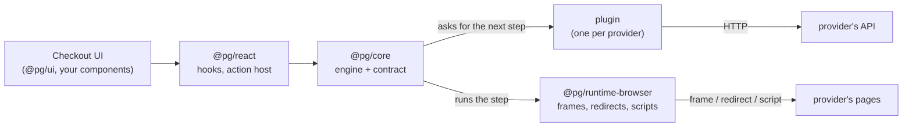
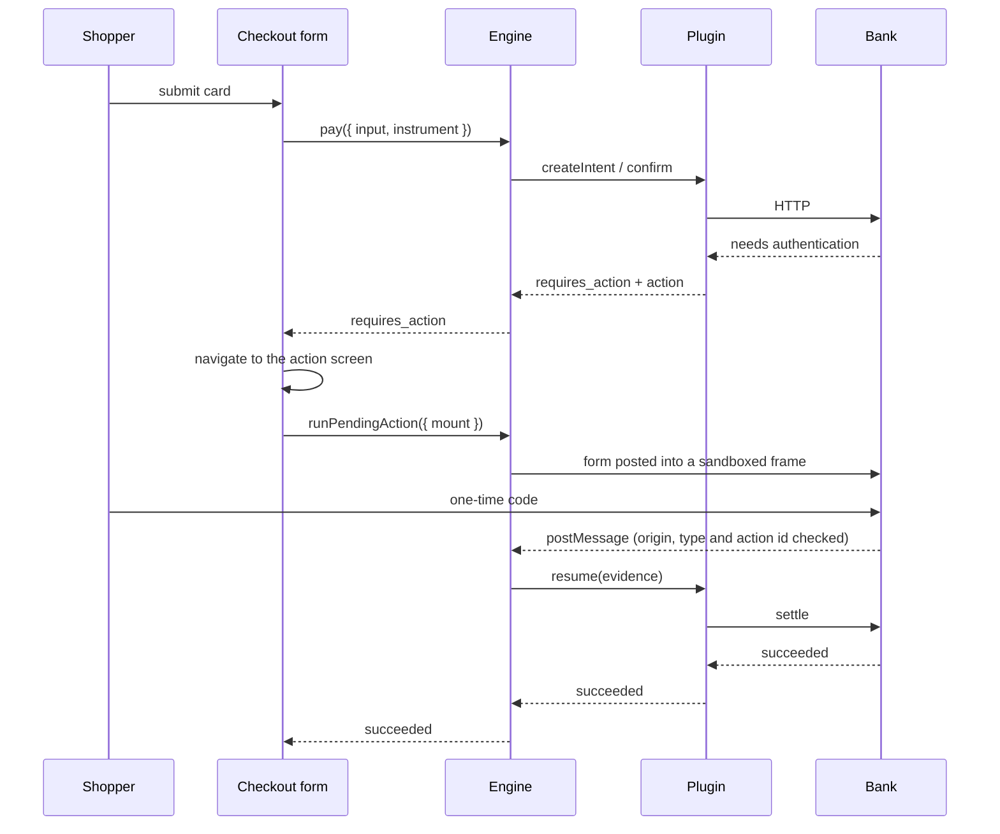
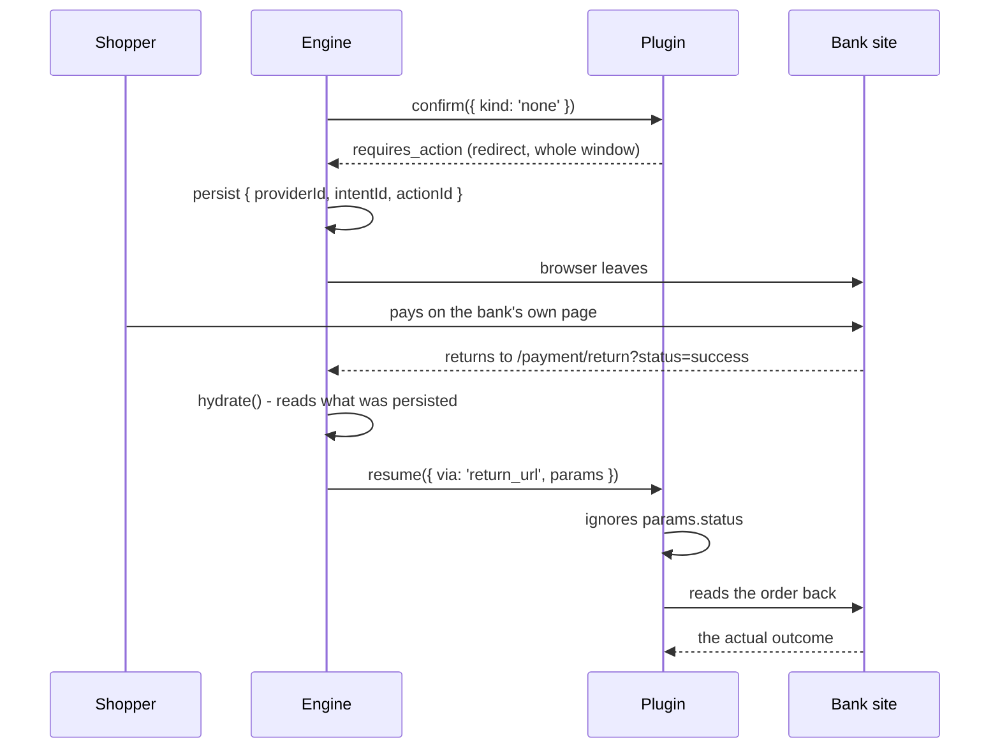

# Architecture

> Русская версия: [architecture.ru.md](./architecture.ru.md)

## The one idea

A checkout has two kinds of knowledge in it, and they age at completely different rates.

One kind is what a payment _is_: it gets created, an instrument is presented, sometimes
something else has to happen before it settles, and in the end it either succeeded, was
declined, or broke. That has not changed in decades.

The other kind is how one particular provider says all that. JSON or form-encoded. A string
status or a number. An error in the HTTP status or inside a successful response. A challenge
in a frame, a redirect to a bank's own page, fields the provider renders itself, a wallet on
the shopper's phone. That changes constantly, differs between providers, and is the reason
"add a second payment provider" so often means rewriting a checkout.

Everything here follows from keeping those apart. The first kind lives in `@pg/core` and is
written once. The second lives in plugins, one per provider, and the core cannot see it.

## One loop, five integrations

```text
createIntent → confirm(instrument) → [ action → run → evidence → resume ]* → terminal
```

That is the whole engine. What differs between integrations is only **which action a
provider returned** and **which runner executes it**:

| Integration        | instrument | first action                    | completes via  |
| ------------------ | ---------- | ------------------------------- | -------------- |
| Card processor     | `card`     | `redirect` into a frame         | `post_message` |
| Acquiring bank     | `card`     | `redirect` with a `PaReq`       | `post_message` |
| Bank payment page  | `none`     | `redirect` taking the window    | `return_url`   |
| Hosted card fields | `none`     | `collect_fields` in a frame     | `post_message` |
| Wallet             | `none`     | `sdk_handoff` to another script | `sdk_callback` |

Note the last three rows: nothing is collected on our side at all. That is not a special
case in the engine — `{ kind: 'none' }` is a perfectly ordinary instrument, and a provider
that needs the card elsewhere simply asks for an action first.



## The packages, and why the seams are there

**`@pg/core`** — the domain, the plugin contract, the engine. No React, no DOM, no bundler
environment. It compiles for a browser, a Node test and a worker alike, and `npm run purity`
fails the build if a browser-only global appears in it. That is not fastidiousness: it is
what lets the entire payment loop, plugins included, run in a plain unit test with scripted
runners standing in for a browser.

**`@pg/runtime-browser`** — everything the engine needs that only a browser has. The runners
that submit forms into sandboxed frames, take over the window, load a third-party script,
and the single `message` listener in the whole checkout. Replace this package and the engine
runs somewhere else entirely.

**`@pg/react`** — hooks over the engine's snapshot, and `<PaymentActionHost/>`: a mount
point that hands the engine a DOM node and reports the result back. It knows no protocol.
Whether that node ends up holding a 3-D Secure challenge or a provider's card fields is the
plugin's decision.

**`@pg/ui`** — the visual kit. Plain CSS, themed through `--pg-*` variables, no framework
asked of the consumer.

**`@pg/provider-*`** — one per integration. This is where a protocol lives, and the only
place it may.

**`@pg/testing`** and **`@pg/conformance`** — the mock backend and the contract suite every
plugin has to pass.

## What the engine actually does

Beyond the loop, the engine is responsible for a handful of things that are easy to get
wrong once and then get wrong forever.

**It stops at the action.** `pay` returns as soon as a provider asks for something, without
running it, because the host usually wants to navigate, mount a frame or show a screen
first. The host then calls `runPendingAction`. That single decision is what puts a full-page
redirect and an inline frame on one code path.

**It writes down what a redirect would destroy.** Before an action runs — not after — the
provider id, intent id and action id go into session storage, because a top-level redirect
ends the page the instant the form submits. `hydrate()` picks the payment back up
afterwards, and awaits the plugin's lazy import before resuming, since the plugin may not be
loaded yet on a freshly restored page.

**It does not believe evidence.** What a runner brings back proves where the browser has
been, not what happened to the money. Anything short of a terminal answer is re-read from
the provider before the shopper is told anything.

**It refuses to loop.** A provider that answers every resume with another action is stopped
after four.

**It never lets a plugin throw at the UI.** Plugins are contractually forbidden from
throwing out of `confirm` and `resume`, and the engine holds that line anyway, because a
plugin is third-party code.

The state machine is a lookup table in its own file with no promises, no provider and no
clock in it, so every legal and illegal transition is a unit test.

## How a payment flows

Card, with an authentication step in a frame:



Hosted payment page, where the shopper leaves entirely:



The second diagram is the one worth remembering. `status=success` arrived on a URL the
shopper could have typed by hand, and it decides nothing.

## Where things live

```text
packages/
  core/                  domain, contract, engine, http. No React, no DOM
    src/domain/          intent, instrument, action, evidence, result
    src/provider/        the plugin contract and capabilities
    src/engine/          machine, store, runners registry, provider registry
  runtime-browser/       runners, watchers, session storage
  react/                 hooks and <PaymentActionHost/>
  ui/                    components and one themable stylesheet
  provider-*/            one per integration
  testing/               mock backend, card table, engine test doubles
  conformance/           the suite every plugin passes

apps/
  demo/                  a checkout that uses all of the above
    src/app/providers/   the composition root: engine, plugins, runtime
    src/features/        the checkout form, the provider switch, receipts
    src/routes/          pages, including the action screen and the return route
    e2e/                 one spec file, run against every integration
  bank-sim/              the https bank: both 3-D Secure protocols
```

The demo keeps Feature-Sliced Design and its own zustand store. The store is a
_projection_ now: it subscribes to the engine and nothing writes back, because two stores
that can both change a payment will eventually disagree about whether the shopper has been
charged.

## What is deliberately absent

**No `capture` or `refund`.** The contract has no verb for them and no screen shows them.
Adding them to mirror a provider's API would be exactly the leak the contract exists to
prevent.

**No `authorized` or `refunded` status.** The acquiring bank reports both; they collapse
into `processing` and `canceled` on the way in. Lossy on purpose — the port speaks the
domain's vocabulary, not the bank's.

**No sandbox around plugin code.** A plugin runs with the page's full privileges. Trusting
a plugin means trusting its code, and the README says so rather than implying otherwise.

**No webhooks or server.** There is no backend to receive them; `poll` covers asynchronous
settlement instead.

## Further reading

- **[Writing a payment plugin](./plugin-authoring.md)** — the contract from the other side.
- **[Iframes and 3-D Secure](./iframe.md)** — how an embedded bank page is sandboxed.
- **[Security headers](./security-headers.md)** — every header the bank simulator sends.
- **[Mock payment API](../packages/testing/README.md)** — endpoints, state machine, test
  cards, idempotency.
