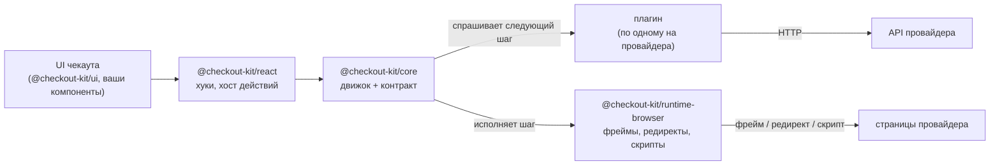
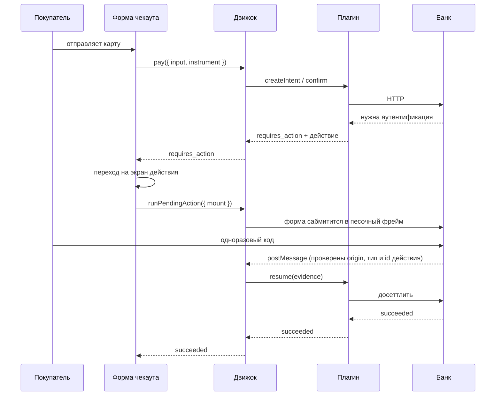
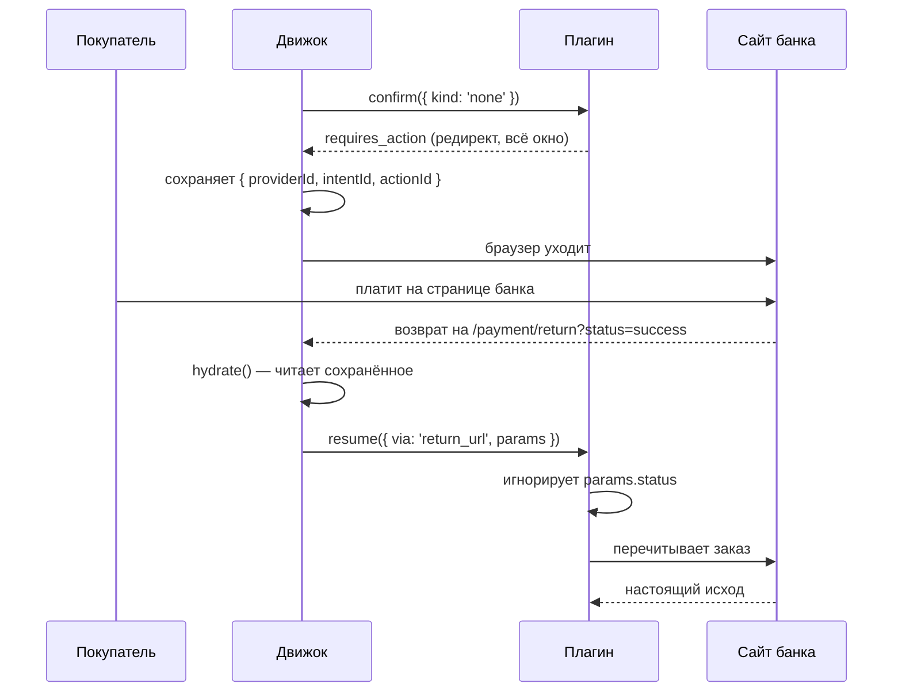

# Архитектура

> English version: [architecture.md](./architecture.md)

## Идея

В чекауте есть два вида знания, и меняются они с очень разной скоростью.

Первый — что такое платёж. Его создают. Предъявляют инструмент. Иногда перед списанием нужен
ещё один шаг. В конце он прошёл, отклонён или сломался. Так было десятилетиями.

Второй — как это описывает конкретный провайдер. JSON или form-urlencoded. Статус словом или
числом. Ошибка в HTTP-коде или внутри успешного ответа. Челлендж во фрейме, редирект на
страницу банка, поля, которые рисует сам провайдер, кошелёк в телефоне. Это меняется часто и
у всех по-разному. Поэтому «добавить второго провайдера» обычно означает переписать чекаут.

Их и держат порознь. Первое живёт в `@checkout-kit/core` и написано один раз. Второе — в плагинах, по
одному на провайдера, и ядро его не видит.

## Один цикл, шесть интеграций

```text
createIntent → confirm(instrument) → [ action → run → evidence → resume ]* → терминал
```

Это весь движок. Между интеграциями отличаются только две вещи: **какое действие вернул
провайдер** и **какой раннер его исполняет**.

| Интеграция               | инструмент | первое действие              | чем завершается |
| ------------------------ | ---------- | ---------------------------- | --------------- |
| Карточный процессинг     | `card`     | `redirect` во фрейм          | `post_message`  |
| Банковский эквайринг     | `card`     | `redirect` с `PaReq`         | `post_message`  |
| Платёжная страница банка | `none`     | `redirect` на всё окно       | `return_url`    |
| Hosted-поля карты        | `none`     | `collect_fields` во фрейме   | `post_message`  |
| Кошелёк                  | `none`     | `sdk_handoff` в чужой скрипт | `sdk_callback`  |
| Мгновенный перевод       | `none`     | `display` — QR или код       | `poll`          |

В трёх последних строках на нашей стороне не собирается ничего. Спецкейса у движка для
этого нет: `{ kind: 'none' }` — обычный инструмент, а провайдер, которому карта нужна в
другом месте, просто сначала просит действие.



## Пакеты

**`@checkout-kit/core`** — домен, контракт плагина, движок. Ни React, ни DOM, ни окружения сборщика.
Компилируется для браузера, Node-теста и воркера, а `npm run purity` роняет сборку, если
внутрь попал браузерный глобал. Благодаря этому весь платёжный цикл прогоняется в юнит-тесте,
где вместо браузера — скриптованные раннеры.

**`@checkout-kit/runtime-browser`** — то, для чего нужен браузер: раннеры, которые сабмитят формы в
песочные фреймы, забирают окно или грузят чужой скрипт, и единственный на весь чекаут
слушатель `message`.

**`@checkout-kit/react`** — хуки над снапшотом движка и `<PaymentActionHost/>`: точка монтирования,
которая отдаёт движку DOM-узел и возвращает результат. Протокола она не знает.

**`@checkout-kit/ui`** — визуальный кит. Обычный CSS, темизация через `--ck-*`.

**`@checkout-kit/provider-*`** — по одному на интеграцию. Протокол живёт здесь и только здесь.

**`@checkout-kit/testing`** и **`@checkout-kit/conformance`** — мок-бэкенд и набор контрактных тестов, который
обязан пройти каждый плагин.

## Что делает движок

Кроме цикла, движок отвечает за несколько вещей, которые легко сделать неправильно.

**Останавливается на действии.** `pay` возвращается, как только провайдер о чём-то попросил,
и сам это не исполняет: хосту обычно нужно сначала перейти на другой экран или смонтировать
фрейм, а потом позвать `runPendingAction`. Благодаря этому редирект и инлайновый фрейм идут
одним путём.

**Сохраняет то, что уничтожит редирект.** До запуска действия id провайдера, интента и
действия уезжают в session storage: полностраничный редирект убивает страницу в момент
сабмита. Потом `hydrate()` поднимает платёж — сначала дождавшись ленивого импорта плагина,
которого на свежей странице может ещё не быть.

**Не верит evidence.** То, что принёс раннер, говорит, где побывал браузер, а не что стало с
деньгами. Если ответ не финальный, интент перечитывается у провайдера.

**Он ждёт деньги, которых не видит.** Если действие завершается опросом — QR-код, квитанция
на перевод — движок запускает раннер и одновременно спрашивает провайдера. Кто ответил
первым, тот останавливает другого: покупатель может уйти, а истёкший код перестаёт
опрашиваться, а не опрашивается до закрытия вкладки.

**Не зацикливается.** Провайдер, который на каждый `resume` отвечает новым действием,
останавливается после четырёх.

**Ловит ошибки плагина.** Плагинам запрещено бросать из `confirm` и `resume`, но плагин — это
чужой код, поэтому движок всё равно ловит.

Машина состояний — таблица переходов в отдельном файле: без промисов, провайдера и часов, так
что каждый переход покрыт маленьким тестом.

## Как проходит платёж

Карта, с аутентификацией во фрейме:



Платёжная страница банка, где покупатель уходит совсем:



Вторую диаграмму стоит запомнить: `status=success` приехал по URL, который покупатель мог
набрать руками, и ничего не решает.

## Где что лежит

```text
packages/
  core/                  домен, контракт, движок, http. Ни React, ни DOM
    src/domain/          интент, инструмент, действие, evidence, результат
    src/provider/        контракт плагина и capabilities
    src/engine/          машина, стор, реестр раннеров, реестр провайдеров
  runtime-browser/       раннеры, watcher'ы, session storage
  react/                 хуки и <PaymentActionHost/>
  ui/                    компоненты и один темизируемый стиль
  provider-*/            по одному на интеграцию
  testing/               мок-бэкенд, таблица карт, тест-дублёры движка
  conformance/           набор, который проходит каждый плагин

apps/
  demo/                  чекаут, который всем этим пользуется
    src/app/providers/   композиционный корень: движок, плагины, рантайм
    src/features/        форма чекаута, переключатель провайдера, чеки
    src/routes/          страницы, включая экран действия и роут возврата
    e2e/                 один спек-файл, прогоняемый по всем интеграциям
  bank-sim/              https-банк: оба протокола 3-D Secure
```

Демо сохраняет Feature-Sliced Design и свой zustand-стор. Стор теперь копия состояния
движка: он подписан и никогда не пишет обратно. Два стора, каждый из которых может менять
платёж, рано или поздно разойдутся в том, списаны ли деньги.

## Чего здесь нет — намеренно

**Нет `capture` и `refund`.** В контракте нет таких глаголов, и ни один экран их не
показывает.

**Нет статусов `authorized` и `refunded`.** Банковский эквайринг сообщает оба; они
схлопываются в `processing` и `canceled`. Часть информации теряется намеренно: домен говорит
своим словарём, а не банковским.

**Нет песочницы вокруг кода плагина.** Плагин работает с полными правами страницы. Доверять
плагину — значит доверять его коду.

**Нет вебхуков и сервера.** Принимать их некому. Платежи, которые завершаются позже,
закрывает `poll`.

## Что почитать дальше

- **[Как написать платёжный плагин](./plugin-authoring.ru.md)** — контракт с другой стороны.
- **[Iframe и 3-D Secure](./iframe.ru.md)** — как изолирована встроенная страница банка.
- **[Security-заголовки](./security-headers.ru.md)** — каждый заголовок симулятора банка.
- **[Мок платёжного API](../packages/testing/README.ru.md)** — эндпоинты, машина состояний,
  тестовые карты, идемпотентность.
