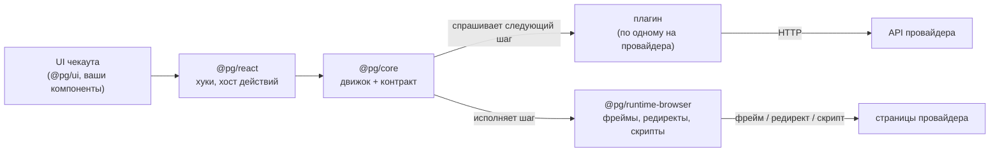
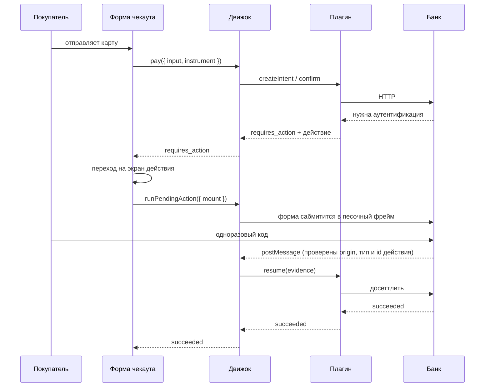
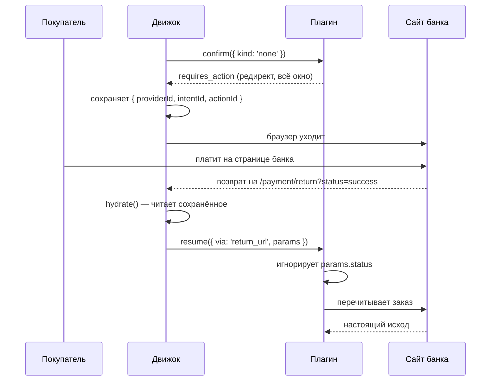

# Архитектура

> English version: [architecture.md](./architecture.md)

## Одна идея

В чекауте живут два вида знания, и стареют они с совершенно разной скоростью.

Первый — что такое платёж вообще: его создают, предъявляют инструмент, иногда перед
списанием должно случиться что-то ещё, и в итоге он либо прошёл, либо отклонён, либо
сломался. Это не меняется десятилетиями.

Второй — как всё это произносит конкретный провайдер. JSON или form-urlencoded. Статус
строкой или числом. Ошибка в HTTP-коде или внутри успешного ответа. Челлендж во фрейме,
редирект на страницу банка, поля, которые рисует сам провайдер, кошелёк в телефоне
покупателя. Это меняется постоянно, у всех по-разному, и именно поэтому «добавить второго
провайдера» так часто означает переписать чекаут.

Всё остальное — следствие того, что эти два вида разведены. Первый живёт в `@pg/core` и
написан один раз. Второй — в плагинах, по одному на провайдера, и ядро его не видит.

## Один цикл, пять интеграций

```text
createIntent → confirm(instrument) → [ action → run → evidence → resume ]* → терминал
```

Это и есть весь движок. Различие между интеграциями — только в том, **какое действие вернул
провайдер** и **какой раннер его исполняет**:

| Интеграция               | инструмент | первое действие              | чем завершается |
| ------------------------ | ---------- | ---------------------------- | --------------- |
| Карточный процессинг     | `card`     | `redirect` во фрейм          | `post_message`  |
| Банковский эквайринг     | `card`     | `redirect` с `PaReq`         | `post_message`  |
| Платёжная страница банка | `none`     | `redirect` на всё окно       | `return_url`    |
| Hosted-поля карты        | `none`     | `collect_fields` во фрейме   | `post_message`  |
| Кошелёк                  | `none`     | `sdk_handoff` в чужой скрипт | `sdk_callback`  |

Обратите внимание на три последние строки: на нашей стороне не собирается вообще ничего. Для
движка это не спецкейс — `{ kind: 'none' }` совершенно обычный инструмент, а провайдер,
которому карта нужна в другом месте, просто сначала просит действие.



## Пакеты и почему швы проходят там, где проходят

**`@pg/core`** — домен, контракт плагина, движок. Ни React, ни DOM, ни окружения сборщика.
Компилируется одинаково для браузера, Node-теста и воркера, а `npm run purity` роняет
сборку, если внутрь просочился браузерный глобал. Это не педантизм: именно это позволяет
прогонять весь платёжный цикл вместе с плагинами в обычном юнит-тесте, где вместо браузера —
скриптованные раннеры.

**`@pg/runtime-browser`** — всё, что движку нужно и что есть только в браузере. Раннеры,
которые сабмитят формы в песочные фреймы, забирают окно, грузят чужой скрипт, и
единственный на весь чекаут слушатель `message`. Замените этот пакет — и движок поедет
куда-то ещё.

**`@pg/react`** — хуки над снапшотом движка и `<PaymentActionHost/>`: точка монтирования,
которая отдаёт движку DOM-узел и возвращает результат. Протокола она не знает. Окажется в
этом узле 3-D Secure или поля карты провайдера — решает плагин.

**`@pg/ui`** — визуальный кит. Обычный CSS, темизация через `--pg-*`, от потребителя не
требуется никакого фреймворка.

**`@pg/provider-*`** — по одному на интеграцию. Здесь живёт протокол, и только здесь ему
можно.

**`@pg/testing`** и **`@pg/conformance`** — мок-бэкенд и набор контрактных тестов, который
обязан пройти каждый плагин.

## Что на самом деле делает движок

Кроме цикла, движок отвечает за несколько вещей, которые легко сделать неправильно один раз
и потом делать неправильно всегда.

**Он останавливается на действии.** `pay` возвращается, как только провайдер о чём-то
попросил, и сам это не исполняет: хосту обычно нужно сначала перейти на другой экран,
смонтировать фрейм или что-то показать. Дальше хост зовёт `runPendingAction`. Именно это
решение кладёт полностраничный редирект и инлайновый фрейм на один путь.

**Он записывает то, что уничтожит редирект.** До запуска действия — не после — id
провайдера, интента и действия уезжают в session storage, потому что редирект на верхнем
уровне убивает страницу в момент сабмита. `hydrate()` потом поднимает платёж и дожидается
ленивого импорта плагина, прежде чем продолжать: на свежевосстановленной странице плагина
может ещё не быть.

**Он не верит evidence.** То, что приносит раннер, доказывает, где побывал браузер, а не то,
что случилось с деньгами. Всё, кроме терминального ответа, перечитывается у провайдера,
прежде чем покупателю что-то скажут.

**Он отказывается зацикливаться.** Провайдер, который на каждый `resume` отвечает новым
действием, останавливается после четырёх.

**Он не даёт плагину бросить в UI.** Плагинам контрактом запрещено бросать из `confirm` и
`resume`, и движок всё равно держит эту границу — плагин это чужой код.

Машина состояний — таблица переходов в отдельном файле, без промисов, провайдера и часов, так
что каждый разрешённый и каждый запрещённый переход покрыт юнит-тестом.

## Как проходит платёж

Карта, с аутентификацией во фрейме:



Платёжная страница банка, где покупатель уходит совсем:



Вторую диаграмму стоит запомнить. `status=success` приехал по URL, который покупатель мог
набрать руками, и не решает ничего.

## Где что лежит

```text
packages/
  core/                  домен, контракт, движок, http. Ни React, ни DOM
    src/domain/          интент, инструмент, действие, evidence, результат
    src/provider/        контракт плагина и capabilities
    src/engine/          машина, стор, реестр раннеров, реестр провайдеров
  runtime-browser/       раннеры, watcher'ы, session storage
  react/                 хуки и <PaymentActionHost/>
  ui/                    компоненты и один темизируемый стиль
  provider-*/            по одному на интеграцию
  testing/               мок-бэкенд, таблица карт, тест-дублёры движка
  conformance/           набор, который проходит каждый плагин

apps/
  demo/                  чекаут, который всем этим пользуется
    src/app/providers/   композиционный корень: движок, плагины, рантайм
    src/features/        форма чекаута, переключатель провайдера, чеки
    src/routes/          страницы, включая экран действия и роут возврата
    e2e/                 один спек-файл, прогоняемый по всем интеграциям
  bank-sim/              https-банк: оба протокола 3-D Secure
```

Демо сохраняет Feature-Sliced Design и свой zustand-стор. Стор теперь **проекция**: он
подписан на движок, и обратной записи нет — два стора, каждый из которых может менять
платёж, рано или поздно разойдутся в том, списаны ли с покупателя деньги.

## Чего здесь сознательно нет

**Нет `capture` и `refund`.** У контракта нет таких глаголов, и ни один экран их не
показывает. Добавить их, чтобы повторить API провайдера, — ровно та протечка, ради
предотвращения которой контракт и существует.

**Нет статусов `authorized` и `refunded`.** Банковский эквайринг сообщает оба; на входе они
схлопываются в `processing` и `canceled`. Потеря намеренная — порт говорит словарём домена, а
не банка.

**Нет песочницы вокруг кода плагина.** Плагин выполняется с полными правами страницы.
Доверять плагину — значит доверять его коду, и README говорит это прямо, а не намекает на
обратное.

**Нет вебхуков и сервера.** Принимать их некому; асинхронное завершение закрывает `poll`.

## Что почитать дальше

- **[Как написать платёжный плагин](./plugin-authoring.ru.md)** — контракт с другой стороны.
- **[Iframe и 3-D Secure](./iframe.ru.md)** — как изолирована встроенная страница банка.
- **[Security-заголовки](./security-headers.ru.md)** — каждый заголовок симулятора банка.
- **[Мок платёжного API](../packages/testing/README.ru.md)** — эндпоинты, машина состояний,
  тестовые карты, идемпотентность.
