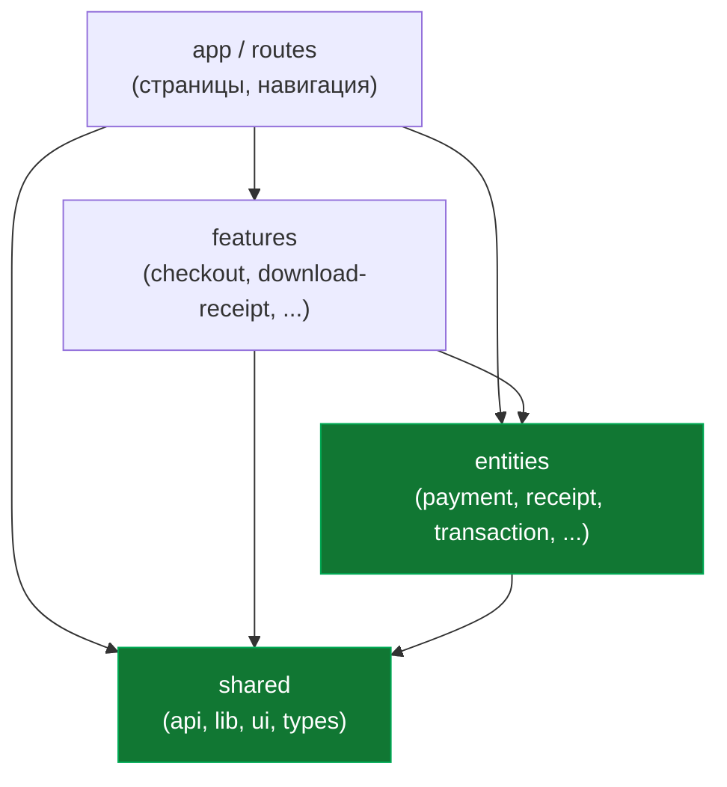
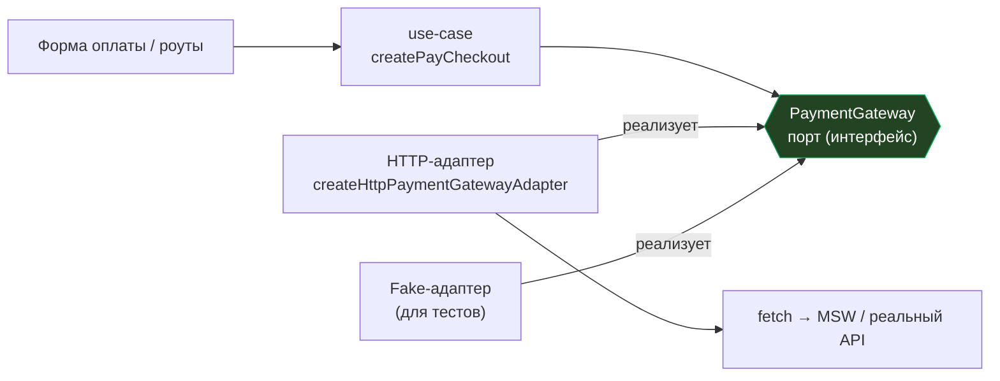
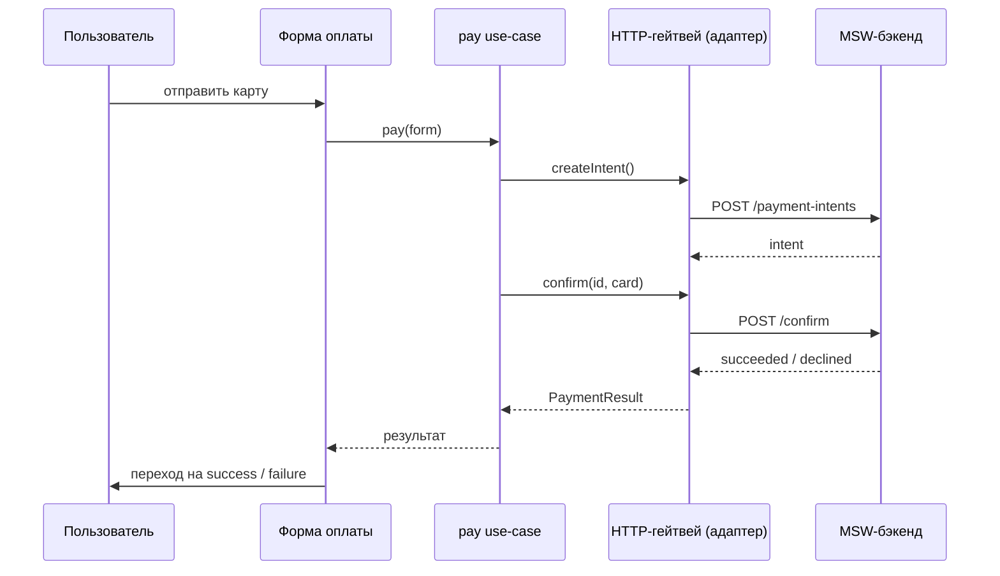
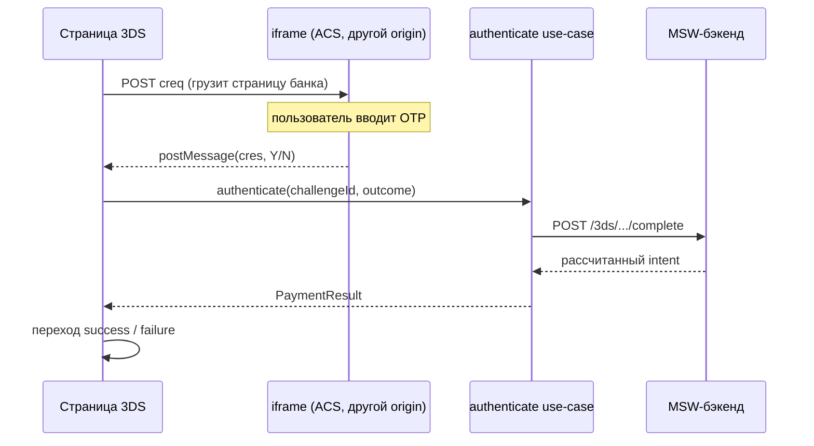
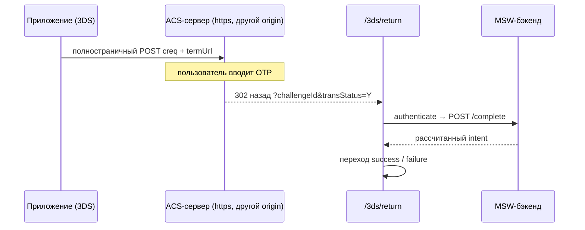
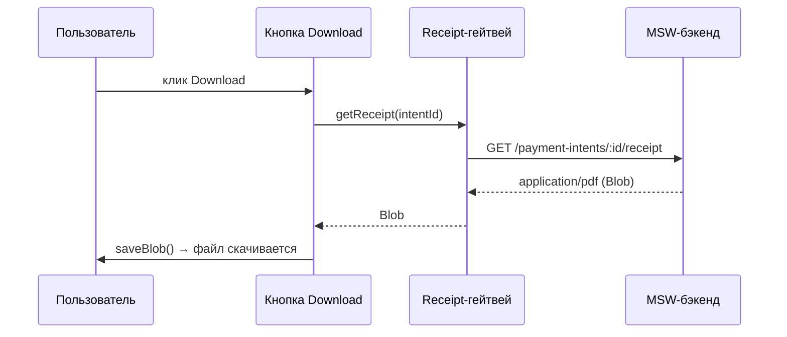

# Архитектура

> English version: [architecture.md](./architecture.md)

Это UI оплаты. Выглядит небольшим, но задевает всё, из-за чего фронтенд со
временем становится тяжёлым: сетевые вызовы, редирект в банк (3-D Secure),
скачивание файлов и правила про деньги. Поэтому у него понятная форма: грязные
детали держим по краям, а важную логику - в центре.

Этот документ объясняет эту форму простыми словами: **зачем** она и **как**
всё связано.

---

## Одна идея

> Важная логика находится в центре и не зависит **ни от чего** снаружи.
> Грязные детали - React, `fetch`, роутер, мок-сервер - живут по краям и
> **заменяемы**.

Всё остальное здесь - следствие этого предложения. Рисуем как стрелки, которые
всегда смотрят **внутрь**: внешнее знает про внутреннее, но не наоборот.



**Правило:** импорты идут только **вниз** по этой картинке. `features` может
использовать `entities`; `entities` может использовать `shared`. **Вверх** -
нельзя: `entity` никогда не импортирует из `feature`. Именно это правило делает
ядро переиспользуемым и тестируемым. (Это и есть раскладка папок из
**Feature-Sliced Design**.)

---

## Слои простыми словами

| Папка             | Что живёт                                                                 | Аналогия               |
| ----------------- | ------------------------------------------------------------------------- | ---------------------- |
| `shared/`         | мелкие общие инструменты: `http-client`, `saveBlob`, UI-кит, базовые типы | ящик с инструментами   |
| `entities/`       | существительные домена: платёж, чек - их типы + **порты** к ним           | словарь                |
| `features/`       | глаголы / сценарии: "оплатить", "пройти 3DS", "скачать чек"               | действия               |
| `app/`, `routes/` | страницы, связывание, навигация - реальные экраны                         | здание                 |
| `src/mocks/`      | фейковый платёжный бэкенд (MSW), чтобы приложение работало без сервера    | манекен для тренировки |
| `acs/`            | отдельный 3-D Secure "банк" для реалистичных тестов redirect/iframe       | спарринг-партнёр       |

---

## Порты и адаптеры

Центр никогда не зовёт `fetch` напрямую. Вместо этого он зависит от **порта** -
обычного TypeScript-интерфейса, который говорит _что_ можно сделать ("создать
платёж", "подтвердить карту"), но не _как_. Конкретный **адаптер** реализует порт
и делает реальный HTTP.



Почему это стоит лишнего файла:

- **Меняем транспорт, остальное не трогаем.** Перейти с `fetch` на `axios` или с
  мока на реальный Stripe - пишешь один новый адаптер. Use-case, страницы и домен
  не меняются.
- **Тестируем логику без сети.** Подсовываешь fake-адаптер с заготовленными
  ответами; use-case гоняется в обычном юнит-тесте, без браузера и сервера.
- **Формат данных сервера остаётся на краю.** Проводной формат бэкенда (DTO)
  переводится в наш доменный тип **внутри адаптера**, поэтому странные имена полей
  не расползаются по приложению.

Порты в проекте:

- `PaymentGateway` - `src/entities/payment/api/payment-gateway.ts`
- `ReceiptGateway` - `src/entities/receipt/api/receipt-gateway.ts`

Их HTTP-адаптеры лежат рядом как `*.adapter.ts`.

---

## Как проходит запрос

### Оплата (без 3-D Secure)



Use-case возвращает `PaymentResult` - простое значение, описывающее _что
произошло_ (`succeeded` / `requires_action` / `declined` / `error`). Он не
навигирует и не трогает сеть. Куда идти дальше, решает страница.

### 3-D Secure - режим iframe

Страница банка живёт в маленьком фрейме внутри нашей. Когда пользователь
закончил, банк присылает вердикт через `postMessage`.



### 3-D Secure - режим redirect (как Santander)

Вся страница уходит в банк; банк отправляет браузер **обратно** на return-URL.
Полная перезагрузка стирает память, поэтому всё нужное едет в URL.



Важное правило безопасности в обоих режимах: `postMessage` / редирект - это только
**подсказка**. Итоговый статус всегда берётся с бэкенда (`authenticate`
перепроверяет). Сообщение можно подделать, ответ бэкенда - нет.

### Скачивание чека



Чек - это непрозрачный PDF, который выдаёт сервер; фронт просто его скачивает.
`saveBlob` (`src/shared/lib/save-blob.ts`) - единственное место, которое трогает
DOM, чтобы запустить скачивание.

---

## Зачем это - и когда перебор

**Получаешь:**

- одно место для правки, когда меняется бэкенд (адаптер),
- ядро, которое тестируется без браузера и без сети,
- свободу заменить мок на реального провайдера, не переписывая экраны,
- имена полей сервера не протекают в UI.

**Цена:**

- больше файлов и лишний прыжок (UI → use-case → порт → адаптер),
- для крошечного одноразового экрана это слишком много церемоний.

Правило: применяй там, где логика настоящая и живёт долго (платежи, авторизация).
Для статической страницы "о нас" - не надо.

---

## Три названия для одной идеи

Дизайн взят из трёх известных подходов. Здесь они **не** конкурируют - это разные
уровни увеличения одной и той же картинки.

| Подход                                                                                                 | Одной строкой                                              | Что даёт здесь                                 |
| ------------------------------------------------------------------------------------------------------ | ---------------------------------------------------------- | ---------------------------------------------- |
| **[Hexagonal (Ports & Adapters)](https://alistair.cockburn.us/hexagonal-architecture/)**               | приложение в центре, интерфейсы по краям, втыкаем адаптеры | порты `*Gateway` + `*.adapter.ts`              |
| **[Clean Architecture](https://blog.cleancoder.com/uncle-bob/2012/08/13/the-clean-architecture.html)** | концентрические кольца; зависимости только внутрь          | правило "стрелки вниз" + кольцо use-case       |
| **[Feature-Sliced Design (FSD)](https://feature-sliced.design/)**                                      | конкретная раскладка папок для фронтенда                   | структура `app / features / entities / shared` |

Коротко: **Hexagonal** - про _края_ (как ядро говорит с миром). **Clean**
добавляет _внутренние кольца_ и строгое правило зависимостей. **FSD** - это _карта
папок_, по которой всё это удобно находить в React-проекте.

Аналогия: розетка в стене (**порт**) - фиксированный контракт; любая вилка
(**адаптер**), которая подходит, работает, и дому всё равно, что воткнуто, - это
Hexagonal. Clean добавляет правило "проводка в стенах, розетки по краям, щиток в
центре". FSD - это план этажа, который говорит, в какой комнате что лежит.

---

## Где что лежит

```
src/
  app/           настройка приложения, провайдеры, переключатель моков
  routes/        страницы + навигация (в т.ч. 3ds/challenge, 3ds/return, summary/*)
  features/
    checkout/
      model/     pay.usecase.ts, authenticate-3ds.usecase.ts   (сценарии)
      ui/        checkout-form.tsx, three-ds-challenge.tsx
    download-receipt/
      model/     generate-receipt.usecase.ts
  entities/
    payment/
      api/       payment-gateway.ts (ПОРТ), http-payment-gateway.adapter.ts
      model/     types.ts (PaymentResult, PaymentIntent, ...)
    receipt/
      api/       receipt-gateway.ts (ПОРТ), http-receipt-gateway.adapter.ts
  shared/
    api/         http-client.ts (обёртка над fetch: get/post/getBlob)
    lib/         save-blob.ts, форматирование, branded-типы
src/mocks/       фейковый бэкенд на MSW (см. src/mocks/README.md)
acs/             симулятор 3-D Secure ACS (см. acs/README.md)
```

---

## Дополнительно почитать

Идеи архитектуры (про "зачем"):

- [Clean Architecture - Robert C. Martin](https://blog.cleancoder.com/uncle-bob/2012/08/13/the-clean-architecture.html)
- [Hexagonal Architecture (Ports & Adapters) - Alistair Cockburn](https://alistair.cockburn.us/hexagonal-architecture/)
- [Feature-Sliced Design - официальная документация](https://feature-sliced.design/)
- [Dependency Inversion Principle - Wikipedia](https://en.wikipedia.org/wiki/Dependency_inversion_principle)

Стек, который здесь используется (про "как"):

- [Mock Service Worker (MSW)](https://mswjs.io/) - фейковый бэкенд
- [TanStack Router](https://tanstack.com/router/latest) - типобезопасные роуты и search-параметры
- [Zustand](https://zustand.docs.pmnd.rs/) - стор
- [React Hook Form](https://react-hook-form.com/) + [Zod](https://zod.dev/) - состояние формы и валидация

Веб-платформа за 3-D Secure (детали безопасности):

- [3-D Secure - Wikipedia](https://en.wikipedia.org/wiki/3-D_Secure)
- [Stripe: 3D Secure authentication](https://docs.stripe.com/payments/3d-secure)
- [MDN: iframe `sandbox`](https://developer.mozilla.org/en-US/docs/Web/HTML/Element/iframe#sandbox)
- [MDN: CSP `frame-ancestors`](https://developer.mozilla.org/en-US/docs/Web/HTTP/Headers/Content-Security-Policy/frame-ancestors)
- [MDN: куки `SameSite`](https://developer.mozilla.org/en-US/docs/Web/HTTP/Headers/Set-Cookie/SameSite)
- [MDN: `window.postMessage`](https://developer.mozilla.org/en-US/docs/Web/API/Window/postMessage)
- [MDN: same-origin policy](https://developer.mozilla.org/en-US/docs/Web/Security/Same-origin_policy)

---

## Словарь

- **Порт** - интерфейс, описывающий _что_ можно сделать, без реализации.
- **Адаптер** - конкретная реализация порта (реальный HTTP или fake для тестов).
- **Use-case** - один сценарий приложения ("оплатить", "аутентифицировать");
  оркестрирует порты, без UI и без `fetch`.
- **DTO** - форма данных, которую сервер шлёт по проводу; переводится в наш
  доменный тип внутри адаптера.
- **Доменный тип** - как _наше_ приложение описывает вещь (например,
  `PaymentResult`), независимо от сервера.
- **Composition root** - единственное место, где создаётся конкретный адаптер и
  внедряется в use-case (здесь: роуты/стор).
- **Правило зависимостей** - импорты идут только внутрь/вниз; ядро не импортирует
  внешние слои.
