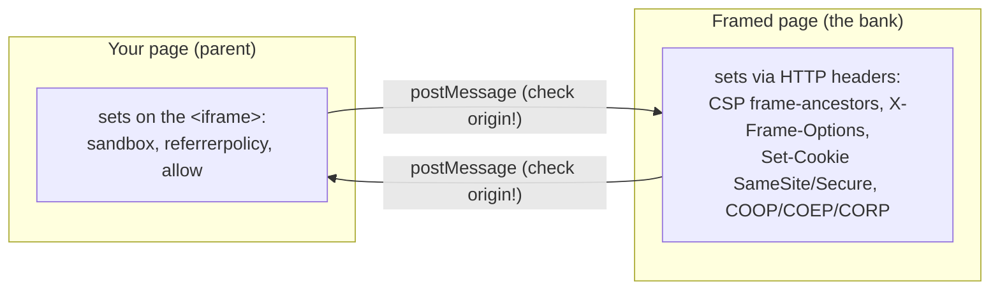

# Iframes and 3-D Secure

> Русская версия: [iframe.ru.md](./iframe.ru.md)

An `<iframe>` shows one web page inside another. 3-D Secure uses this: the bank's
challenge page is loaded inside our checkout page. That sounds simple, but the
moment the two pages come from different sites (different origins), the browser
puts a wall between them for safety. This document explains that wall - what each
setting does, why it exists, and how our project uses it.

If you only remember one thing: **the parent page and the framed page each control
different things, and they cannot read each other's insides.**

---

## Two sides of the wall



- The **parent** decides how much the frame is allowed to do (via attributes on the
  `<iframe>` tag).
- The **framed page** decides who is allowed to embed it and how its cookies behave
  (via HTTP response headers).
- Neither can reach into the other's DOM when they are cross-origin. They only talk
  through `postMessage`.

---

## What the parent sets (attributes on `<iframe>`)

In this project: `src/features/checkout/ui/three-ds-challenge.tsx`.

### `sandbox`

A locked-down frame that grants back only the capabilities you list.

| Flag we use | What it grants | Why |
| --- | --- | --- |
| `allow-scripts` | run JavaScript | the bank page needs it |
| `allow-forms` | submit forms | to send the OTP |
| `allow-same-origin` | keep its own origin | so its cookies work and its `postMessage` has a real `event.origin` |

Flags we deliberately **do not** grant: `allow-top-navigation` (a frame should not
be able to move your whole window), `allow-popups`, `allow-modals`.

The famous gotcha: `allow-scripts` + `allow-same-origin` together are dangerous
**only if the framed page is same-origin as the parent** - then it could script its
own sandbox off. Here the bank is a different origin, so `allow-same-origin` just
lets it keep the bank's origin. It gives the frame no power over our page.

Alternative: drop `allow-same-origin` entirely. Then the frame runs in an "opaque"
origin - no cookies, and its messages arrive with `event.origin === "null"`, which
breaks the origin check. That is why we keep it for a cross-origin bank.

### `referrerpolicy="no-referrer"`

Do not tell the bank which page sent the user. Alternative: `strict-origin` sends
only the origin, not the full URL.

### `allow` (Permissions Policy)

Grants specific browser features to the frame (camera, one-time-code autofill,
WebAuthn, ...). We do not need any here, so we omit it. Real bank SDKs sometimes add
`allow="otp-credentials; publickey-credentials-get"` for OTP autofill and passkeys.

### `target` on the form

The hidden form posts into the frame with `target="acs-frame"` (iframe mode). The
same form with `target="_top"` sends the **whole window** to the bank instead -
that is the redirect mode (see below).

---

## What the framed page sets (HTTP headers)

In this project: `acs/lib.ts` (`securityHeaders`).

| Header | What it does | Alternative |
| --- | --- | --- |
| `Content-Security-Policy: frame-ancestors <origin>` | who may embed this page (anti-clickjacking) | `X-Frame-Options` (legacy) |
| `X-Frame-Options: ALLOW-FROM / DENY / SAMEORIGIN` | old version of the above; modern browsers ignore `ALLOW-FROM` | use `frame-ancestors` |
| `Set-Cookie: ...; SameSite=None; Secure` | lets the cookie exist inside a third-party frame (needs https) | `SameSite=Lax/Strict` = no cross-site cookie |
| `Cross-Origin-Opener-Policy: same-origin` | isolate the browsing-context group | `unsafe-none` to turn off |
| `Cross-Origin-Embedder-Policy: require-corp` | require subresources to opt in | `unsafe-none` |
| `Cross-Origin-Resource-Policy: cross-origin` | allow another origin to embed this response | `same-origin` to block |
| `X-Content-Type-Options: nosniff` | stop MIME sniffing | - |

The cookie line is the one people trip on: a frame from another site is a
"third-party" context, and modern browsers drop its cookies unless they are
`SameSite=None; Secure`. `Secure` means https only - which is why the ACS server
runs over TLS.

---

## Talking across the wall: `postMessage`

Cross-origin pages cannot read each other's variables or DOM (the same-origin
policy). The only channel is `window.postMessage`. Two rules keep it safe:

1. When you **receive** a message, check `event.origin` against an allowlist. A
   message alone proves nothing - any page could send a fake "success".
2. When you **send**, pass an explicit target origin, never `"*"`.

```js
// receiving (parent)
window.addEventListener('message', (event) => {
  if (event.origin !== ACS_ORIGIN) return // trust only the bank
  // ...treat as a hint, then confirm with the backend
})
```

Golden rule for payments: the message is only a hint. The real outcome always comes
from your backend (here `authenticate()` re-checks the status). A message can be
forged; a server answer cannot.

---

## Iframe vs full-page redirect

Banks do 3-D Secure in one of two shapes, and this project supports both.

| | Iframe | Full-page redirect |
| --- | --- | --- |
| Where the bank shows | in a frame inside your page | your whole page navigates to the bank |
| Return signal | `postMessage` back to the parent | the bank sends a `302` to your return URL |
| Your state | kept (no reload) | wiped (full reload) - carry what you need in the URL |
| Cookies | third-party (needs `SameSite=None; Secure`) | first-party on the bank's own page |
| `frame-ancestors` | matters | not involved (top-level page) |

That last row is the real reason both exist: inside a frame the bank is a
third-party (strict cookie and clickjacking rules); as a top-level redirect it is
first-party and those rules relax.

---

## How this project wires it

- Parent / UI: `src/features/checkout/ui/three-ds-challenge.tsx` - the `<iframe>`,
  its `sandbox`/`referrerpolicy`, the two forms (iframe and redirect), and the
  origin-checked `message` listener.
- Framed "bank": `acs/` - a standalone https server that sets the headers above and,
  in redirect mode, `302`s back to `/3ds/return`. See [acs/README.md](../acs/README.md).
- The wider payment picture: [architecture.md](./architecture.md).

---

## Further reading

- [MDN: the `<iframe>` element](https://developer.mozilla.org/en-US/docs/Web/HTML/Element/iframe)
- [MDN: iframe `sandbox`](https://developer.mozilla.org/en-US/docs/Web/HTML/Element/iframe#sandbox)
- [MDN: `Window.postMessage`](https://developer.mozilla.org/en-US/docs/Web/API/Window/postMessage)
- [MDN: same-origin policy](https://developer.mozilla.org/en-US/docs/Web/Security/Same-origin_policy)
- [MDN: CSP `frame-ancestors`](https://developer.mozilla.org/en-US/docs/Web/HTTP/Headers/Content-Security-Policy/frame-ancestors)
- [MDN: `X-Frame-Options`](https://developer.mozilla.org/en-US/docs/Web/HTTP/Headers/X-Frame-Options)
- [MDN: `SameSite` cookies](https://developer.mozilla.org/en-US/docs/Web/HTTP/Headers/Set-Cookie/SameSite)
- [MDN: Permissions Policy (`allow`)](https://developer.mozilla.org/en-US/docs/Web/HTTP/Permissions_Policy)
- [OWASP: Clickjacking defense](https://cheatsheetseries.owasp.org/cheatsheets/Clickjacking_Defense_Cheat_Sheet.html)
- [Stripe: 3D Secure authentication](https://docs.stripe.com/payments/3d-secure)
