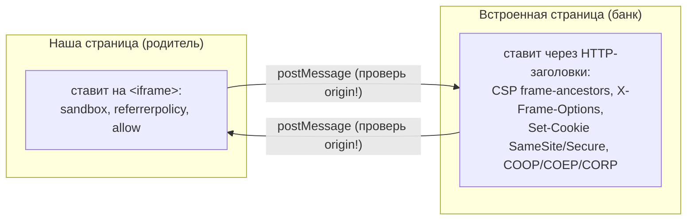
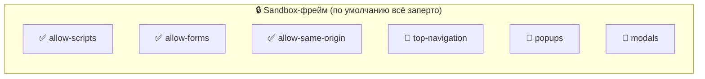
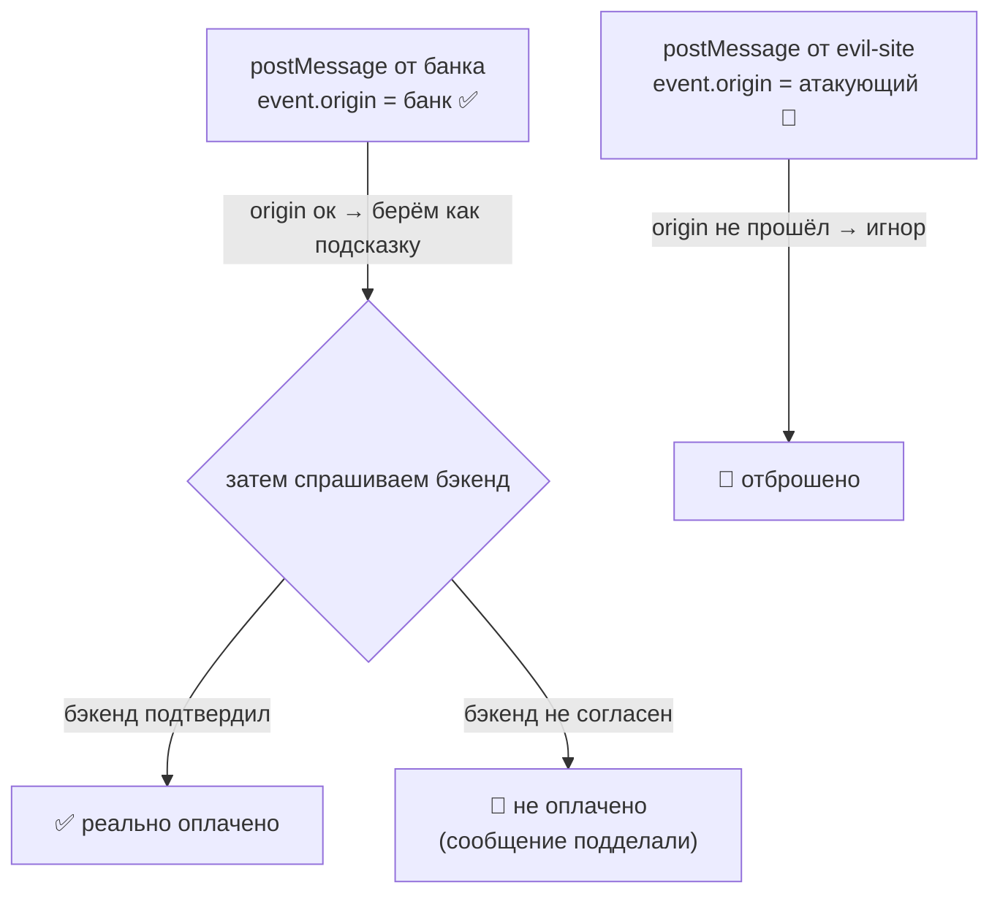

# Iframe и 3-D Secure

> English version: [iframe.md](./iframe.md)

`<iframe>` показывает одну веб-страницу внутри другой. 3-D Secure так и работает:
страница банка грузится внутри нашей страницы оплаты. Звучит просто, но как только
две страницы с разных сайтов (разные origin), браузер ставит между ними стену ради
безопасности. Этот документ объясняет стену: что делает каждая настройка, зачем она
и как это используется в проекте.

Если запомнить только одно: **родительская и встроенная страницы управляют разными
вещами и не могут читать внутренности друг друга.**

---

## Две стороны стены



- **Родитель** решает, что фрейму вообще позволено (через атрибуты тега `<iframe>`).
- **Встроенная страница** решает, кому можно её встраивать и как ведут себя её куки
  (через HTTP-заголовки ответа).
- Пока они cross-origin, ни одна не лезет в DOM другой. Общение - только через
  `postMessage`.

---

## Что ставит родитель (атрибуты `<iframe>`)

В проекте: `apps/demo/src/features/checkout/ui/three-ds-challenge.tsx`.

### `sandbox`

Закрытый фрейм, которому возвращают только перечисленные возможности.

| Флаг, который мы даём | Что разрешает         | Зачем                                                                |
| --------------------- | --------------------- | -------------------------------------------------------------------- |
| `allow-scripts`       | выполнять JavaScript  | странице банка это нужно                                             |
| `allow-forms`         | отправлять формы      | чтобы отправить OTP                                                  |
| `allow-same-origin`   | сохранить свой origin | чтобы работали её куки и `postMessage` имел настоящий `event.origin` |

Флаги, которые мы намеренно **не** даём: `allow-top-navigation` (фрейм не должен
уметь увести всё окно), `allow-popups`, `allow-modals`.



Известная ловушка: `allow-scripts` + `allow-same-origin` вместе опасны **только если
встроенная страница того же origin, что и родитель** - тогда она могла бы снять свой
же sandbox. Здесь банк на другом origin, поэтому `allow-same-origin` просто оставляет
ему origin банка. Власти над нашей страницей это фрейму не даёт.

Альтернатива: убрать `allow-same-origin` совсем. Тогда фрейм получает "непрозрачный"
origin - без кук, а его сообщения приходят с `event.origin === "null"`, что ломает
проверку origin. Поэтому для cross-origin банка мы его оставляем.

### `referrerpolicy="no-referrer"`

Не сообщать банку, с какой страницы пришёл пользователь. Альтернатива:
`strict-origin` шлёт только origin, без полного URL.

### `allow` (Permissions Policy)

Выдаёт фрейму конкретные возможности браузера (камера, автозаполнение OTP, WebAuthn
и т.д.). Здесь ничего не нужно, поэтому опускаем. Реальные банковские SDK иногда
добавляют `allow="otp-credentials; publickey-credentials-get"` для автозаполнения
OTP и passkeys.

### `target` у формы

Скрытая форма постит в фрейм с `target="acs-frame"` (режим iframe). Та же форма с
`target="_top"` отправляет **всё окно** в банк - это режим redirect (ниже).

---

## Что ставит встроенная страница (HTTP-заголовки)

В проекте: `apps/bank-sim/src/acs/lib.ts` (`securityHeaders`).

> Подробный разбор каждого заголовка простыми словами:
> [security-headers.ru.md](./security-headers.ru.md).

| Заголовок                                           | Что делает                                                          | Альтернатива                                |
| --------------------------------------------------- | ------------------------------------------------------------------- | ------------------------------------------- |
| `Content-Security-Policy: frame-ancestors <origin>` | кто может встраивать страницу (антиclickjacking)                    | `X-Frame-Options` (легаси)                  |
| `X-Frame-Options: ALLOW-FROM / DENY / SAMEORIGIN`   | старая версия того же; современные браузеры игнорируют `ALLOW-FROM` | используйте `frame-ancestors`               |
| `Set-Cookie: ...; SameSite=None; Secure`            | разрешает куке жить в third-party фрейме (нужен https)              | `SameSite=Lax/Strict` = нет cross-site куки |
| `Cross-Origin-Opener-Policy: same-origin`           | изолирует группу browsing-context                                   | `unsafe-none` - выключить                   |
| `Cross-Origin-Embedder-Policy: require-corp`        | требует, чтобы субресурсы явно соглашались                          | `unsafe-none`                               |
| `Cross-Origin-Resource-Policy: cross-origin`        | разрешает другому origin встроить этот ответ                        | `same-origin` - заблокировать               |
| `X-Content-Type-Options: nosniff`                   | запрет MIME-sniffing                                                | -                                           |

Строка с кукой - то, на чём спотыкаются: фрейм с другого сайта это "third-party"
контекст, и современные браузеры выкидывают его куки, если они не
`SameSite=None; Secure`. `Secure` значит только https - поэтому ACS-сервер работает
по TLS.

---

## Разговор через стену: `postMessage`

Cross-origin страницы не могут читать переменные и DOM друг друга (same-origin
policy). Единственный канал - `window.postMessage`. Две вещи держат его безопасным:

1. Когда **получаешь** сообщение, проверь `event.origin` по белому списку. Само
   сообщение ничего не доказывает - фейковый "success" может прислать кто угодно.
2. Когда **шлёшь**, указывай явный target origin, никогда `"*"`.

```js
// приём (родитель)
window.addEventListener('message', (event) => {
  if (event.origin !== ACS_ORIGIN) return // доверяем только банку
  // ...считаем подсказкой, затем подтверждаем на бэкенде
})
```

Золотое правило для платежей: сообщение - только подсказка. Итог всегда берётся с
бэкенда (здесь `authenticate()` перепроверяет статус). Сообщение можно подделать,
ответ сервера - нет.



---

## Iframe против полного редиректа

Банки делают 3-D Secure в одной из двух форм, и проект поддерживает обе.

|                     | Iframe                                      | Полный редирект                                     |
| ------------------- | ------------------------------------------- | --------------------------------------------------- |
| Где показывает банк | во фрейме внутри страницы                   | вся страница уходит в банк                          |
| Сигнал возврата     | `postMessage` в родителя                    | банк шлёт `302` на return-URL                       |
| Твоё состояние      | сохраняется (без перезагрузки)              | стирается (полная перезагрузка) - неси нужное в URL |
| Куки                | third-party (нужен `SameSite=None; Secure`) | first-party на странице банка                       |
| `frame-ancestors`   | важен                                       | не задействован (top-level страница)                |

Последняя строка - и есть причина, зачем существуют оба: во фрейме банк это
third-party (строгие правила кук и антиclickjacking); как top-level редирект он
first-party, и правила смягчаются.

---

## Как это связано в проекте

- Родитель / UI: `apps/demo/src/features/checkout/ui/three-ds-challenge.tsx` - сам `<iframe>`,
  его `sandbox`/`referrerpolicy`, две формы (iframe и redirect) и слушатель
  `message` с проверкой origin.
- Встроенный "банк": `apps/bank-sim/src/acs/` - отдельный https-сервер, который ставит заголовки выше
  и в режиме redirect делает `302` на `/3ds/return`. См. [apps/bank-sim/README.md](../apps/bank-sim/README.md).
- Общая картина платежей: [architecture.ru.md](./architecture.ru.md).

---

## Дополнительно почитать

- [MDN: элемент `<iframe>`](https://developer.mozilla.org/en-US/docs/Web/HTML/Element/iframe)
- [MDN: iframe `sandbox`](https://developer.mozilla.org/en-US/docs/Web/HTML/Element/iframe#sandbox)
- [MDN: `Window.postMessage`](https://developer.mozilla.org/en-US/docs/Web/API/Window/postMessage)
- [MDN: same-origin policy](https://developer.mozilla.org/en-US/docs/Web/Security/Same-origin_policy)
- [MDN: CSP `frame-ancestors`](https://developer.mozilla.org/en-US/docs/Web/HTTP/Headers/Content-Security-Policy/frame-ancestors)
- [MDN: `X-Frame-Options`](https://developer.mozilla.org/en-US/docs/Web/HTTP/Headers/X-Frame-Options)
- [MDN: куки `SameSite`](https://developer.mozilla.org/en-US/docs/Web/HTTP/Headers/Set-Cookie/SameSite)
- [MDN: Permissions Policy (`allow`)](https://developer.mozilla.org/en-US/docs/Web/HTTP/Permissions_Policy)
- [OWASP: защита от clickjacking](https://cheatsheetseries.owasp.org/cheatsheets/Clickjacking_Defense_Cheat_Sheet.html)
- [Stripe: 3D Secure authentication](https://docs.stripe.com/payments/3d-secure)
