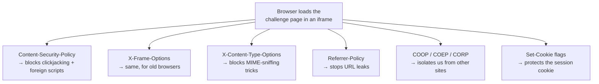
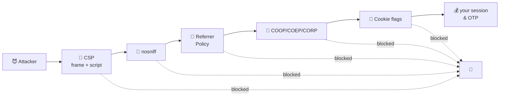
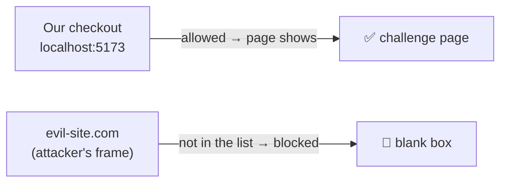
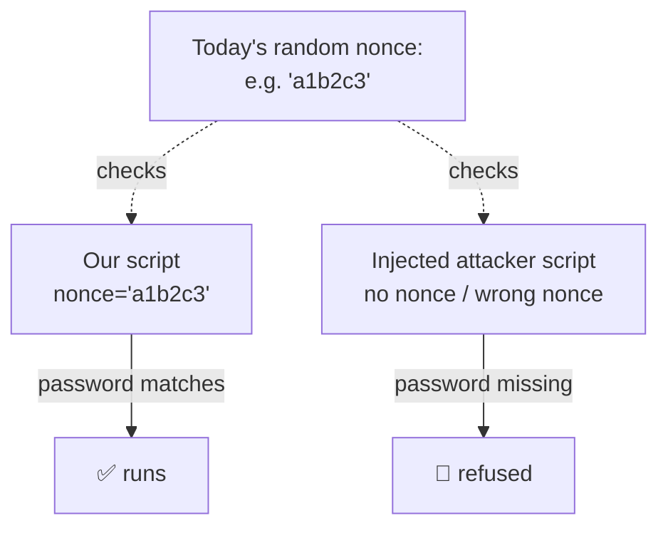
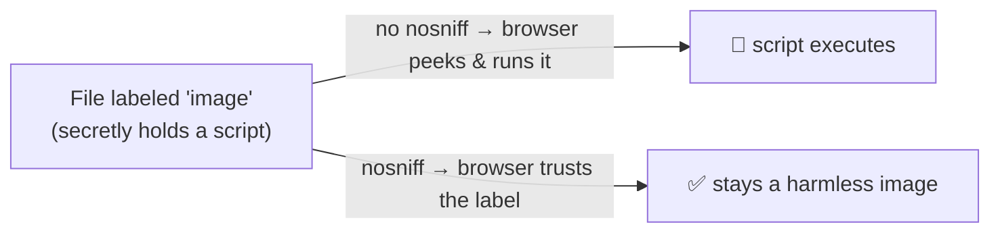
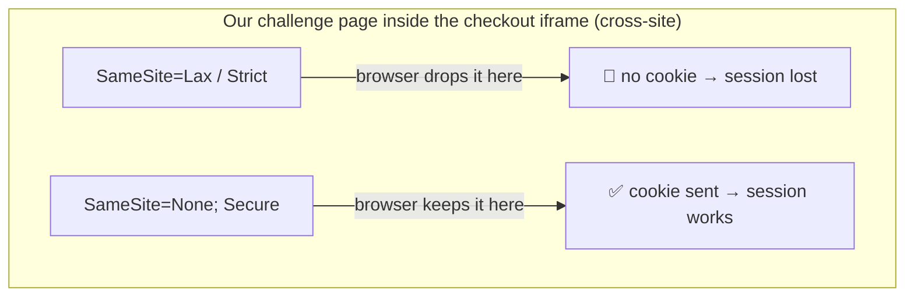

# Security headers on the challenge page

> Русская версия: [security-headers.ru.md](./security-headers.ru.md)

When your browser asks a web server for a page, the server does not only send back
the HTML. It also sends a short list of **response headers** — little "rules" that
tell the browser how to treat the page. You never see them, but the browser obeys
them strictly.

Our 3-D Secure challenge page (the bank's "enter the one-time code" screen) runs
**inside an iframe** on the checkout page. An iframe is one web page shown inside
another. Because money and login codes are involved, that page sends a careful set
of these rules to protect itself. All of them live in one place:
`acs/lib.ts` → `securityHeaders(nonce)`.

This document explains every header we send, in plain words:

- **What it is** (with a real-life analogy)
- **Why we need it here**
- **What attack it stops**
- **What the alternatives are**
- **How it differs from similar headers**

If you only remember one thing: **each header closes one specific door. Attackers
only need one open door, so we close all of them.**

---

## The big picture

Another way to picture it — **defense in depth**. An attacker has to get past every
locked door in a row. Miss one and the attack stops:

Every header is a different lock. Below we open each one up.

---

## 1. `Content-Type: text/html; charset=utf-8`

**What it is (plain words).** A label on the package that says "this is an HTML
page, written in the UTF-8 alphabet." It tells the browser _what kind of thing_ it
just received and _which character set_ to read it with.

**Why we need it here.** So the browser renders our page as a real web page (not as
raw text or a file to download), and so accented letters / non-Latin characters show
up correctly instead of as garbage.

**What it stops.** Naming the charset explicitly removes an old trick where an
attacker sneaks in characters in a _different_ encoding to slip past filters (an
XSS-through-encoding attack). "utf-8, and nothing else" removes that ambiguity.

**Alternatives.** You could leave the charset out and let the browser guess — but
guessing is exactly what we want to avoid. Being explicit is the safe choice.

**How it differs from similar headers.** `Content-Type` says _what the file is_.
The next header, `X-Content-Type-Options`, tells the browser to **trust that label
and not second-guess it**. They work as a pair.

---

## 2. `Content-Security-Policy` (CSP)

This is the most powerful header. Think of it as **the page's own security guard
with a written list of rules**: "scripts may only come from here, forms may only
go there, and only these sites may put me in a frame." The browser enforces the
list. In our code the rules are joined with `; ` into one header.

We use five rules (directives):

### 2a. `frame-ancestors http://localhost:5173`

**Plain words.** "Only _this_ site is allowed to display me inside its frame."
`http://localhost:5173` is our own checkout app (the value comes from the
`PARENT_ORIGIN` setting).

**What it stops — clickjacking.** An attacker copies our real page into a hidden,
transparent frame on their own evil site, then tricks you into typing your one-time
code or clicking "Confirm" while you think you're somewhere else. With
`frame-ancestors`, any site _other than ours_ trying to frame the page gets a blank
box instead. The attack simply fails.

**Alternatives.** The old way is the `X-Frame-Options` header (see #3). CSP
`frame-ancestors` is the modern replacement — more flexible (it can list several
sites) and actually respected by all current browsers.

### 2b. `default-src 'none'`

**Plain words.** "By default, this page may load _nothing_ — no scripts, no images,
no fonts, nothing." Then we open up only the few things we truly need. This is the
"deny everything, then allow a little" approach, which is far safer than "allow
everything, then block a few bad things."

**What it stops.** If an attacker manages to inject a tag that tries to pull code or
data from their server, `default-src 'none'` blocks it because we never allowed it.

**Alternatives.** You could allow `'self'` (our own site) by default. That's still
reasonable, but `'none'` is stricter and forces every exception to be deliberate.

### 2c. `style-src 'unsafe-inline'`

**Plain words.** "Inline `<style>` written directly in this page is allowed." Our
page keeps its small CSS right inside the HTML, so we permit that.

**Why not stricter?** The word `'unsafe-inline'` sounds scary, and for _scripts_ it
would be dangerous. For _styles_ the risk is small. The cleaner alternative is to
move CSS into a separate `.css` file and allow only `'self'` — stricter, at the cost
of an extra file.

**How it differs from `script-src`.** Styles get the loose rule; scripts get the
strict, nonce-based rule below. That difference is on purpose: a rogue script can
steal your code, a rogue style mostly cannot.

### 2d. `script-src 'nonce-...'`

**Plain words.** A **nonce** is a random one-time password generated fresh for each
page load. Our one legitimate inline `<script>` carries this password. The browser
runs _only_ scripts that show the matching password and refuses every other script.

**What it stops — XSS (cross-site scripting).** This is the big one. If an attacker
manages to inject their own `<script>` into the page, it won't have today's random
password, so the browser refuses to run it. Their attack is dead on arrival.

**Alternatives.**

- **Hash** — instead of a random password, allow a script whose _content_ matches a
  known fingerprint. Good for scripts that never change.
- **External file** + `'self'` — move the script to a `.js` file and allow only our
  own domain. Also strong.
- **`'unsafe-inline'`** — allow any inline script. Never do this for scripts; it
  defeats the whole purpose.

**How it differs from the style rule.** Same idea (control what runs), but scripts
get the tightest possible leash because they are the most dangerous.

### 2e. `form-action 'self'`

**Plain words.** "Any form on this page may only submit back to _us_." So even if
someone altered the page, the code you type couldn't be posted to a stranger's
server.

**What it stops.** Data exfiltration — a tampered form quietly sending your input
somewhere else.

**Alternatives.** List specific allowed URLs instead of `'self'` if you legitimately
post to more than one place. We only post to ourselves, so `'self'` is exact.

---

## 3. `X-Frame-Options: ALLOW-FROM http://localhost:5173`

**Plain words.** The **old** way of saying "who may put me in a frame" — the same
job as `frame-ancestors` (#2a), but from an earlier era of the web.

**Why we still send it.** Some very old browsers understand `X-Frame-Options` but not
CSP `frame-ancestors`. Sending both means old and new browsers are all covered.

**Important caveat.** The `ALLOW-FROM` value is basically dead — modern browsers
ignore it entirely and rely on CSP instead. So think of this header as a courtesy for
legacy browsers, while `frame-ancestors` is the control that actually does the work
today.

**How it differs from `frame-ancestors`.** Same purpose (anti-clickjacking).
`frame-ancestors` can list many sites and is honored everywhere now; `X-Frame-Options`
allows at most one site and is legacy. This is a classic "new header supersedes old
header" pair.

---

## 4. `X-Content-Type-Options: nosniff`

**Plain words.** "Browser, trust my `Content-Type` label and do **not** try to guess
what this file really is." "Sniffing" is the browser's habit of peeking at a file's
contents and overriding the stated type.

**What it stops — MIME sniffing attacks.** Suppose an attacker uploads a file that
_claims_ to be a harmless image but actually contains script. Without `nosniff`, a
browser might "helpfully" notice the script and run it. With `nosniff`, the browser
takes our word for it and never treats an image as code.

**Alternatives.** There is no softer version worth using — you either send `nosniff`
or you leave the door open. It's a simple on/off switch, and on is correct.

**How it differs from `Content-Type`.** `Content-Type` _states_ the type;
`nosniff` _forbids second-guessing_ that statement. One declares, the other enforces.

---

## 5. `Referrer-Policy: no-referrer`

**Plain words.** When you click a link or a page loads another resource, the browser
normally whispers "by the way, I came from _this_ URL" to the destination. That's the
**referrer**. `no-referrer` tells the browser to stay silent.

**Why we need it here.** Our page's URL can contain sensitive identifiers (session or
transaction ids). We don't want those leaking to any other server the page talks to.

**What it stops.** URL leakage — private info hidden in the address quietly ending up
in someone else's server logs.

**Alternatives (from loose to strict).**

- `no-referrer-when-downgrade` — the old default; leaks the full URL to other
  secure sites.
- `strict-origin` — sends only the _site name_ (e.g. `https://bank.com`), never the
  full path. A good middle ground.
- `no-referrer` — sends nothing at all. We chose the strictest option because the
  page handles money.

**How it differs from the cross-origin headers below.** `Referrer-Policy` controls
_what info we reveal when we reach out_; COOP/COEP/CORP control _how other pages may
interact with us_. Different direction of protection.

---

## 6. `Cross-Origin-Opener-Policy: same-origin` (COOP)

**Plain words.** "Put me in my own private room, away from any other site that opened
me." Normally, if page A opens page B in a new window/tab, they keep a small link to
each other. COOP cuts that link when the other side isn't us.

**What it stops.** A malicious page that opened ours can no longer poke at our window
object or use it as a stepping stone for cross-site attacks.

**Alternatives.** `unsafe-none` turns this off (the old default). `same-origin` is
the safe choice.

**How it differs from COEP/CORP.** See the joint comparison after #8.

---

## 7. `Cross-Origin-Embedder-Policy: require-corp` (COEP)

**Plain words.** "Everything I load from elsewhere must _explicitly agree_ to be
loaded by me." It refuses to pull in foreign resources that haven't opted in.

**What it stops.** Together with COOP, it puts the page into a hardened, isolated
state. This closes the door on a whole family of sneaky memory-timing attacks
(Spectre-style) where one site tries to spy on data from another.

**Alternatives.** `unsafe-none` turns it off. `require-corp` is the strict, isolating
setting.

---

## 8. `Cross-Origin-Resource-Policy: cross-origin` (CORP)

**Plain words.** "I allow _another_ origin (namely our checkout app) to embed this
response." Since our page is deliberately loaded inside a different site's iframe,
we must say "yes, cross-origin embedding is OK for me."

**What it stops (and why it's set to `cross-origin` here).** CORP normally protects a
resource from being embedded by strangers. But _our whole point_ is to be embedded by
our own app, which is on a different origin — so we open it to `cross-origin` on
purpose. Setting it to `same-origin` would block our own iframe and break the flow.

**Alternatives.** `same-origin` (only we may embed it) or `same-site`. We need
`cross-origin` because parent and child are different origins in this design.

### COOP vs COEP vs CORP — the family compared

They sound alike but guard different things:

| Header   | Question it answers                  | In one line                                 |
| -------- | ------------------------------------ | ------------------------------------------- |
| **COOP** | Who shares a browser "room" with me? | Isolate my window from other sites.         |
| **COEP** | What am I allowed to pull in?        | Only load foreign stuff that opted in.      |
| **CORP** | Who is allowed to embed _me_?        | Let our app embed this page across origins. |

COOP + COEP together unlock "cross-origin isolation" (the strong anti-Spectre state);
CORP is the per-resource opt-in that makes embedding work.

---

## 9. `Set-Cookie: acs_sid=...; Path=/; HttpOnly; Secure; SameSite=None`

**Plain words.** A cookie is a small note the browser stores and hands back on each
visit — here it's the challenge session id (`acs_sid`). The extra words after it are
**safety flags**:

- **`HttpOnly`** — JavaScript on the page cannot read this cookie. Even if an attacker
  slipped in a script, they couldn't steal the session id with it.
- **`Secure`** — the cookie is only ever sent over HTTPS (encrypted), never plain
  HTTP. It cannot be sniffed on the wire.
- **`SameSite=None`** — this is the tricky one. By default, browsers _refuse_ to send
  cookies to a page living inside a **third-party iframe** (which is exactly our
  situation). `SameSite=None` says "yes, send this cookie even in a cross-site
  iframe." It only works when paired with `Secure`.
- **`Path=/`** — the cookie applies to the whole site.

**What it stops.** `HttpOnly` blocks cookie theft via injected scripts; `Secure`
blocks theft over the network; together they protect the session that proves "this is
the same user who started the challenge."

**Why `SameSite=None` and not something stricter?**

| Value    | Behavior                                      | Fits our case?                      |
| -------- | --------------------------------------------- | ----------------------------------- |
| `Strict` | Never sent from another site's context        | No — our iframe would get no cookie |
| `Lax`    | Sent on top-level navigation only             | No — still blocked inside an iframe |
| `None`   | Sent everywhere, including cross-site iframes | Yes — required here (with `Secure`) |

We use the least strict `SameSite` **on purpose**, because the whole flow depends on a
cookie surviving inside a cross-site iframe. We claw the safety back with `HttpOnly`
and `Secure`.

---

## Cheat sheet

| Header                                   | Protects against                     | Common alternative                             |
| ---------------------------------------- | ------------------------------------ | ---------------------------------------------- |
| `Content-Type` + charset                 | encoding-based XSS, garbled text     | let the browser guess (worse)                  |
| CSP `frame-ancestors`                    | clickjacking                         | `X-Frame-Options` (legacy)                     |
| CSP `default-src 'none'`                 | loading anything unexpected          | `default-src 'self'`                           |
| CSP `style-src`                          | (allows our inline CSS)              | move CSS to a file + `'self'`                  |
| CSP `script-src 'nonce-…'`               | XSS (injected scripts)               | hash, or external file + `'self'`              |
| CSP `form-action 'self'`                 | data exfiltration via forms          | explicit URL allow-list                        |
| `X-Frame-Options`                        | clickjacking (old browsers)          | CSP `frame-ancestors`                          |
| `X-Content-Type-Options: nosniff`        | MIME-sniffing attacks                | (none — keep it on)                            |
| `Referrer-Policy: no-referrer`           | URL / secret leakage                 | `strict-origin`                                |
| COOP `same-origin`                       | cross-window snooping                | `unsafe-none` (off)                            |
| COEP `require-corp`                      | Spectre-style leaks                  | `unsafe-none` (off)                            |
| CORP `cross-origin`                      | (allows our app to embed us)         | `same-origin` (would block us)                 |
| Cookie `HttpOnly; Secure; SameSite=None` | cookie theft; iframe cookie blocking | `SameSite=Lax/Strict` (would break the iframe) |

---

## Where this lives in the code

All of these are set in one function:
[`acs/lib.ts`](../acs/lib.ts) → `securityHeaders(nonce)`.

Want to see them for real? Open the challenge page in your browser's DevTools →
**Network** tab → click the request → **Headers**. Every rule above will be listed
under Response Headers.
