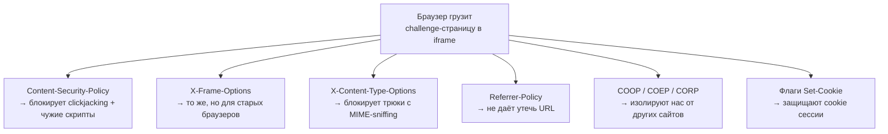
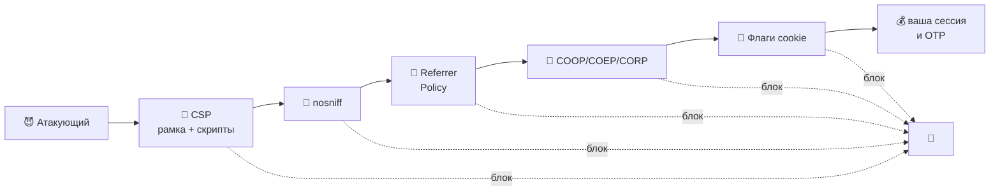
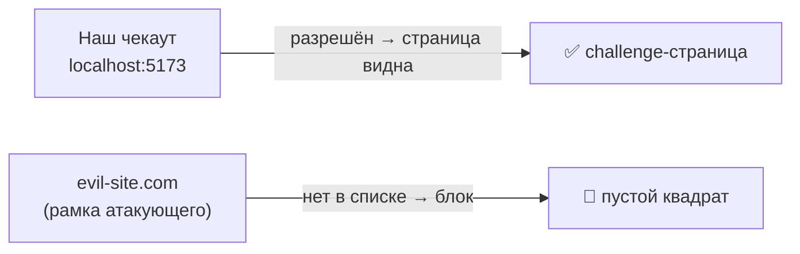
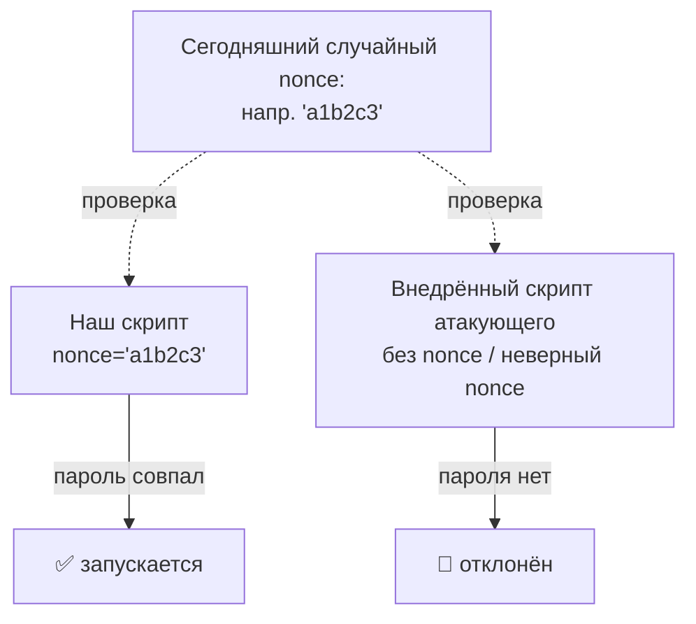
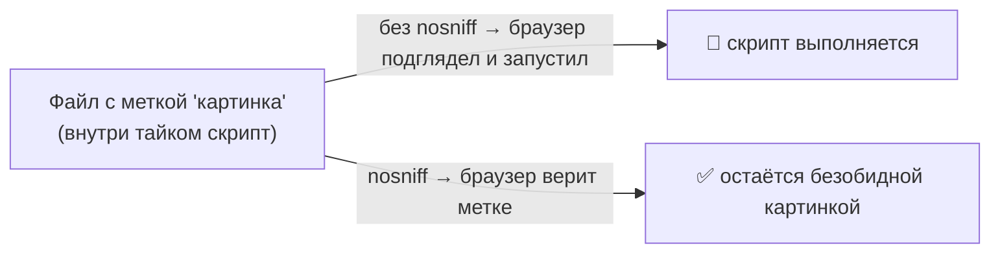
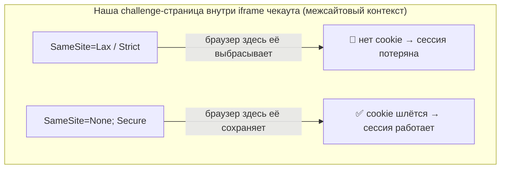

# Security-заголовки challenge-страницы

> English version: [security-headers.md](./security-headers.md)

Когда браузер просит у сервера страницу, сервер присылает не только HTML. Вместе с
ним идёт короткий список **заголовков ответа** — это маленькие «правила», которые
говорят браузеру, как обращаться со страницей. Вы их не видите, но браузер выполняет
их строго.

Наша страница 3-D Secure (тот самый экран банка «введите одноразовый код») работает
**внутри iframe** на странице оформления заказа. Iframe — это одна веб-страница,
показанная внутри другой. Так как речь про деньги и коды входа, эта страница шлёт
продуманный набор таких правил, чтобы защитить себя. Все они лежат в одном месте:
`apps/bank-sim/src/acs/lib.ts` → `securityHeaders(nonce)`.

Этот документ разбирает каждый заголовок простыми словами:

- **Что это такое** (с житейской аналогией)
- **Зачем он нам здесь**
- **От какой атаки спасает**
- **Какие есть альтернативы**
- **Чем отличается от похожих заголовков**

Если запомнить только одно: **каждый заголовок закрывает одну конкретную дверь.
Атакующему достаточно одной открытой двери — поэтому мы закрываем их все.**

---

## Общая картина

Ещё один образ — **эшелонированная оборона** (defense in depth). Атакующему нужно
пройти подряд все запертые двери. Промахнулся хоть на одной — атака останавливается:

Каждый заголовок — отдельный замок. Ниже открываем каждый.

---

## 1. `Content-Type: text/html; charset=utf-8`

**Что это простыми словами.** Наклейка на посылке: «это HTML-страница, написанная
алфавитом UTF-8». Она говорит браузеру, _что за штука_ к нему пришла и _каким набором
символов_ её читать.

**Зачем он нам здесь.** Чтобы браузер показал нашу страницу как настоящую веб-страницу
(а не как голый текст или файл для скачивания), и чтобы буквы с акцентами / кириллица
отображались правильно, а не «кракозябрами».

**От чего спасает.** Явно указанный charset убирает старый трюк, когда атакующий
подсовывает символы в _другой_ кодировке, чтобы проскочить мимо фильтров (XSS через
кодировку). «utf-8 и никак иначе» убирает эту неоднозначность.

**Альтернативы.** Можно вообще не указывать charset и дать браузеру угадать — но
угадывание это ровно то, чего мы хотим избежать. Явно указать — безопасный выбор.

**Чем отличается от похожих.** `Content-Type` говорит, _что это за файл_. Следующий
заголовок, `X-Content-Type-Options`, велит браузеру **доверять этой наклейке и не
перепроверять её**. Работают в паре.

---

## 2. `Content-Security-Policy` (CSP)

Самый мощный заголовок. Представьте его как **личного охранника страницы со списком
правил**: «скрипты только отсюда, формы отправлять только туда, вставлять меня в
рамку могут только эти сайты». Браузер обеспечивает выполнение списка. В нашем коде
правила склеены через `; ` в один заголовок.

Мы используем пять правил (директив):

### 2a. `frame-ancestors http://localhost:5173`

**Простыми словами.** «Показывать меня в своей рамке может _только этот_ сайт».
`http://localhost:5173` — это наше собственное приложение оформления заказа (значение
берётся из настройки `PARENT_ORIGIN`).

**От чего спасает — clickjacking (подмена клика).** Атакующий копирует нашу настоящую
страницу в скрытую прозрачную рамку на своём злом сайте и обманом заставляет вас ввести
одноразовый код или нажать «Подтвердить», пока вы думаете, что находитесь совсем в
другом месте. С `frame-ancestors` любой _чужой_ сайт, попытавшийся вставить страницу в
рамку, получит пустой квадрат. Атака просто не срабатывает.

**Альтернативы.** Старый способ — заголовок `X-Frame-Options` (см. #3). CSP
`frame-ancestors` — современная замена: гибче (можно перечислить несколько сайтов) и
реально уважается всеми актуальными браузерами.

### 2b. `default-src 'none'`

**Простыми словами.** «По умолчанию странице нельзя грузить _ничего_ — ни скриптов, ни
картинок, ни шрифтов». А потом мы открываем лишь то немногое, что реально нужно. Это
подход «запретить всё, потом разрешить чуть-чуть», и он куда безопаснее, чем «разрешить
всё, потом заблокировать пару плохих вещей».

**От чего спасает.** Если атакующему удастся вставить тег, который пытается подтянуть
код или данные с его сервера, `default-src 'none'` это заблокирует — мы такого не
разрешали.

**Альтернативы.** Можно по умолчанию разрешить `'self'` (свой сайт). Тоже разумно, но
`'none'` строже и заставляет каждое исключение делать осознанно.

### 2c. `style-src 'unsafe-inline'`

**Простыми словами.** «Inline-`<style>`, написанный прямо внутри страницы, разрешён».
Наша страница держит свой небольшой CSS прямо в HTML, поэтому мы это позволяем.

**Почему не строже?** Слово `'unsafe-inline'` звучит страшно, и для _скриптов_ это
было бы опасно. Для _стилей_ риск маленький. Более чистая альтернатива — вынести CSS в
отдельный `.css`-файл и разрешить только `'self'`: строже ценой лишнего файла.

**Чем отличается от `script-src`.** Стилям — мягкое правило, скриптам — строгое,
на основе nonce (ниже). Разница специально: вредный скрипт может украсть ваш код,
вредный стиль — в основном нет.

### 2d. `script-src 'nonce-...'`

**Простыми словами.** **Nonce** — это случайный одноразовый пароль, который заново
генерируется на каждую загрузку страницы. Наш единственный легитимный inline-`<script>`
несёт этот пароль. Браузер запускает _только_ те скрипты, что показывают подходящий
пароль, и отклоняет все остальные.

**От чего спасает — XSS (межсайтовый скриптинг).** Это главное. Если атакующему удастся
внедрить свой `<script>` в страницу, у него не будет сегодняшнего случайного пароля —
и браузер откажется его запускать. Атака мертва сразу.

**Альтернативы.**

- **Hash (хэш)** — вместо случайного пароля разрешить скрипт, чьё _содержимое_
  совпадает с известным «отпечатком». Хорошо для скриптов, которые не меняются.
- **Внешний файл** + `'self'` — вынести скрипт в `.js` и разрешить только свой домен.
  Тоже надёжно.
- **`'unsafe-inline'`** — разрешить любой inline-скрипт. Для скриптов так делать
  нельзя никогда — это убивает весь смысл.

**Чем отличается от правила для стилей.** Идея та же (контролировать, что выполняется),
но скрипты держат на самом коротком поводке, потому что они опаснее всего.

### 2e. `form-action 'self'`

**Простыми словами.** «Любая форма на этой странице может отправляться только _к нам_».
Так что даже если кто-то изменит страницу, введённый вами код нельзя будет отправить на
чужой сервер.

**От чего спасает.** Утечка данных — подменённая форма, которая тихо шлёт ваш ввод
куда-то ещё.

**Альтернативы.** Вместо `'self'` перечислить конкретные разрешённые URL, если вы
законно отправляете данные не в одно место. Мы шлём только себе — поэтому `'self'`
точен.

---

## 3. `X-Frame-Options: ALLOW-FROM http://localhost:5173`

**Простыми словами.** **Старый** способ сказать «кто может вставить меня в рамку» — та
же работа, что у `frame-ancestors` (#2a), но из более ранней эпохи веба.

**Почему всё ещё шлём.** Некоторые очень старые браузеры понимают `X-Frame-Options`, но
не понимают CSP `frame-ancestors`. Отправляя оба, мы покрываем и старые, и новые
браузеры.

**Важная оговорка.** Значение `ALLOW-FROM` фактически мертво — современные браузеры его
полностью игнорируют и полагаются на CSP. То есть этот заголовок — вежливость по
отношению к легаси-браузерам, а реальную работу сегодня делает `frame-ancestors`.

**Чем отличается от `frame-ancestors`.** Цель та же (защита от clickjacking).
`frame-ancestors` умеет перечислять много сайтов и уважается везде; `X-Frame-Options`
допускает максимум один сайт и является легаси. Классическая пара «новый заголовок
заменяет старый».

---

## 4. `X-Content-Type-Options: nosniff`

**Простыми словами.** «Браузер, доверяй моей наклейке `Content-Type` и **не** пытайся
угадать, что это за файл на самом деле». «Sniffing» — привычка браузера подглядывать в
содержимое файла и переопределять заявленный тип.

**От чего спасает — атаки через MIME-sniffing.** Допустим, атакующий загружает файл,
который _притворяется_ безобидной картинкой, но на деле содержит скрипт. Без `nosniff`
браузер может «услужливо» заметить скрипт и запустить его. С `nosniff` браузер верит
нашей наклейке и никогда не примет картинку за код.

**Альтернативы.** Мягкой версии, которую стоило бы использовать, нет — либо шлёшь
`nosniff`, либо оставляешь дверь открытой. Это простой выключатель, и «включено» —
правильный вариант.

**Чем отличается от `Content-Type`.** `Content-Type` _заявляет_ тип; `nosniff`
_запрещает перепроверять_ это заявление. Один объявляет — другой обеспечивает.

---

## 5. `Referrer-Policy: no-referrer`

**Простыми словами.** Когда вы кликаете по ссылке или страница грузит другой ресурс,
браузер обычно шепчет получателю: «кстати, я пришёл с _этого_ URL». Это **referrer**.
`no-referrer` велит браузеру молчать.

**Зачем он нам здесь.** URL нашей страницы может содержать чувствительные
идентификаторы (id сессии или транзакции). Мы не хотим, чтобы они утекали на любой
другой сервер, с которым общается страница.

**От чего спасает.** Утечка URL — приватная информация, спрятанная в адресе, тихо
оседает в чужих логах сервера.

**Альтернативы (от мягкого к строгому).**

- `no-referrer-when-downgrade` — старое поведение по умолчанию; сливает полный URL
  другим защищённым сайтам.
- `strict-origin` — шлёт только _имя сайта_ (например, `https://bank.com`), никогда не
  полный путь. Хорошая золотая середина.
- `no-referrer` — не шлёт вообще ничего. Мы выбрали самый строгий вариант, потому что
  страница работает с деньгами.

**Чем отличается от cross-origin заголовков ниже.** `Referrer-Policy` управляет тем,
_какую информацию мы раскрываем, когда сами обращаемся наружу_; COOP/COEP/CORP
управляют тем, _как другие страницы могут взаимодействовать с нами_. Разное направление
защиты.

---

## 6. `Cross-Origin-Opener-Policy: same-origin` (COOP)

**Простыми словами.** «Помести меня в отдельную комнату, подальше от любого другого
сайта, который меня открыл». Обычно, если страница A открывает страницу B в новом
окне/вкладке, между ними остаётся тонкая связь. COOP обрывает эту связь, когда с той
стороны не мы.

**От чего спасает.** Вредная страница, открывшая нашу, больше не может копаться в нашем
объекте окна или использовать его как ступеньку для межсайтовых атак.

**Альтернативы.** `unsafe-none` выключает это (старое поведение по умолчанию).
`same-origin` — безопасный выбор.

**Чем отличается от COEP/CORP.** См. общее сравнение после #8.

---

## 7. `Cross-Origin-Embedder-Policy: require-corp` (COEP)

**Простыми словами.** «Всё, что я гружу со стороны, должно _явно согласиться_ быть
загруженным мной». Он отказывается подтягивать чужие ресурсы, которые на это не
подписались.

**От чего спасает.** Вместе с COOP он переводит страницу в укреплённое, изолированное
состояние. Это закрывает целое семейство хитрых атак на тайминги памяти
(типа Spectre), когда один сайт пытается подсмотреть данные другого.

**Альтернативы.** `unsafe-none` выключает. `require-corp` — строгая, изолирующая
настройка.

---

## 8. `Cross-Origin-Resource-Policy: cross-origin` (CORP)

**Простыми словами.** «Я разрешаю _другому_ origin (а именно нашему приложению чекаута)
встраивать этот ответ». Так как наша страница специально грузится внутри iframe другого
сайта, мы обязаны сказать «да, межоригинное встраивание для меня допустимо».

**От чего спасает (и почему тут стоит `cross-origin`).** Обычно CORP защищает ресурс
от встраивания чужаками. Но _весь наш смысл_ — быть встроенными нашим же приложением,
которое находится на другом origin, — поэтому мы намеренно открываемся на
`cross-origin`. Если поставить `same-origin`, то заблокируется наш собственный iframe и
поток сломается.

**Альтернативы.** `same-origin` (встраивать можем только мы) или `same-site`. Нам нужен
`cross-origin`, потому что в этой схеме родитель и ребёнок — разные origin.

### COOP vs COEP vs CORP — сравнение семейства

Звучат похоже, но охраняют разное:

| Заголовок | На какой вопрос отвечает              | В одну строку                                          |
| --------- | ------------------------------------- | ------------------------------------------------------ |
| **COOP**  | Кто делит со мной «комнату» браузера? | Изолировать моё окно от других сайтов.                 |
| **COEP**  | Что мне разрешено подтягивать?        | Грузить только чужое, что дало согласие.               |
| **CORP**  | Кому разрешено встраивать _меня_?     | Дать нашему приложению встроить страницу через origin. |

COOP + COEP вместе включают «cross-origin isolation» (сильное состояние против
Spectre); CORP — это согласие на уровне ресурса, которое делает встраивание рабочим.

---

## 9. `Set-Cookie: acs_sid=...; Path=/; HttpOnly; Secure; SameSite=None`

**Простыми словами.** Cookie — это маленькая записка, которую браузер хранит и отдаёт
обратно при каждом визите; здесь это id сессии challenge (`acs_sid`). Слова после него
— это **флаги безопасности**:

- **`HttpOnly`** — JavaScript на странице не может прочитать эту cookie. Даже если
  атакующий протащил скрипт, украсть им id сессии не выйдет.
- **`Secure`** — cookie отправляется только по HTTPS (шифрование), никогда по голому
  HTTP. Её нельзя перехватить в сети.
- **`SameSite=None`** — вот это хитрое. По умолчанию браузеры _отказываются_ слать
  cookie странице, живущей внутри **стороннего iframe** (а это ровно наш случай).
  `SameSite=None` говорит «да, шли эту cookie даже в межсайтовом iframe». Работает
  только в паре с `Secure`.
- **`Path=/`** — cookie действует на весь сайт.

**От чего спасает.** `HttpOnly` блокирует кражу cookie через внедрённые скрипты;
`Secure` блокирует кражу по сети; вместе они защищают сессию, которая доказывает, что
«это тот же пользователь, что начал challenge».

**Почему `SameSite=None`, а не что-то строже?**

| Значение | Поведение                                    | Подходит нам?                         |
| -------- | -------------------------------------------- | ------------------------------------- |
| `Strict` | Никогда не шлётся из контекста другого сайта | Нет — наш iframe не получит cookie    |
| `Lax`    | Шлётся только при переходе на верхнем уровне | Нет — внутри iframe всё равно блок    |
| `None`   | Шлётся везде, включая межсайтовые iframe     | Да — тут это обязательно (с `Secure`) |

Мы используем самый нестрогий `SameSite` **намеренно**, потому что весь поток зависит
от того, чтобы cookie выжила внутри межсайтового iframe. Безопасность отыгрываем обратно
через `HttpOnly` и `Secure`.

---

## Шпаргалка

| Заголовок                                | От чего защищает                           | Частая альтернатива                    |
| ---------------------------------------- | ------------------------------------------ | -------------------------------------- |
| `Content-Type` + charset                 | XSS через кодировку, «кракозябры»          | дать браузеру угадать (хуже)           |
| CSP `frame-ancestors`                    | clickjacking                               | `X-Frame-Options` (легаси)             |
| CSP `default-src 'none'`                 | загрузка чего угодно лишнего               | `default-src 'self'`                   |
| CSP `style-src`                          | (разрешает наш inline CSS)                 | вынести CSS в файл + `'self'`          |
| CSP `script-src 'nonce-…'`               | XSS (внедрённые скрипты)                   | hash или внешний файл + `'self'`       |
| CSP `form-action 'self'`                 | утечка данных через формы                  | явный список URL                       |
| `X-Frame-Options`                        | clickjacking (старые браузеры)             | CSP `frame-ancestors`                  |
| `X-Content-Type-Options: nosniff`        | атаки через MIME-sniffing                  | (нет — держать включённым)             |
| `Referrer-Policy: no-referrer`           | утечка URL / секретов                      | `strict-origin`                        |
| COOP `same-origin`                       | подглядывание между окнами                 | `unsafe-none` (выкл.)                  |
| COEP `require-corp`                      | утечки типа Spectre                        | `unsafe-none` (выкл.)                  |
| CORP `cross-origin`                      | (разрешает нашему приложению встроить нас) | `same-origin` (заблокирует нас)        |
| Cookie `HttpOnly; Secure; SameSite=None` | кража cookie; блок cookie в iframe         | `SameSite=Lax/Strict` (сломает iframe) |

---

## Где это в коде

Всё это задаётся в одной функции:
[`apps/bank-sim/src/acs/lib.ts`](../apps/bank-sim/src/acs/lib.ts) → `securityHeaders(nonce)`.

Хотите увидеть вживую? Откройте challenge-страницу в DevTools браузера → вкладка
**Network** → кликните на запрос → **Headers**. Все правила выше будут в разделе
Response Headers.
