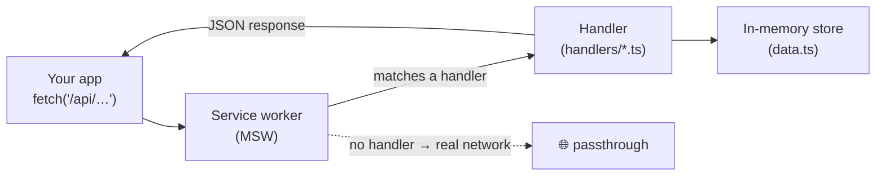
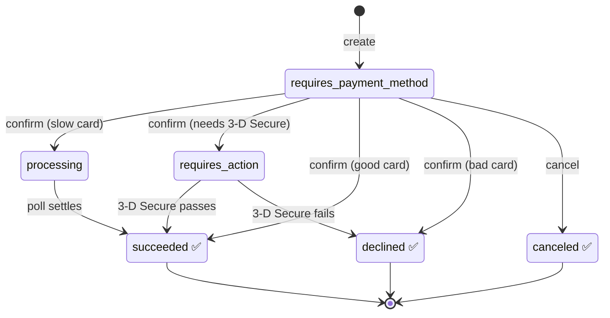
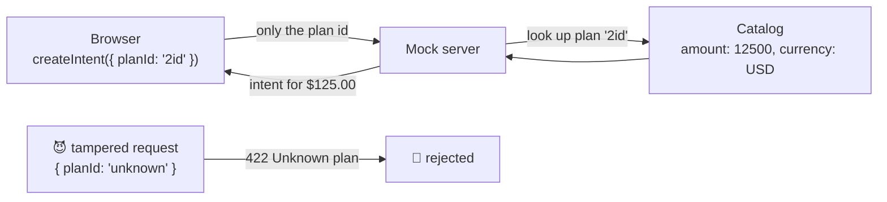
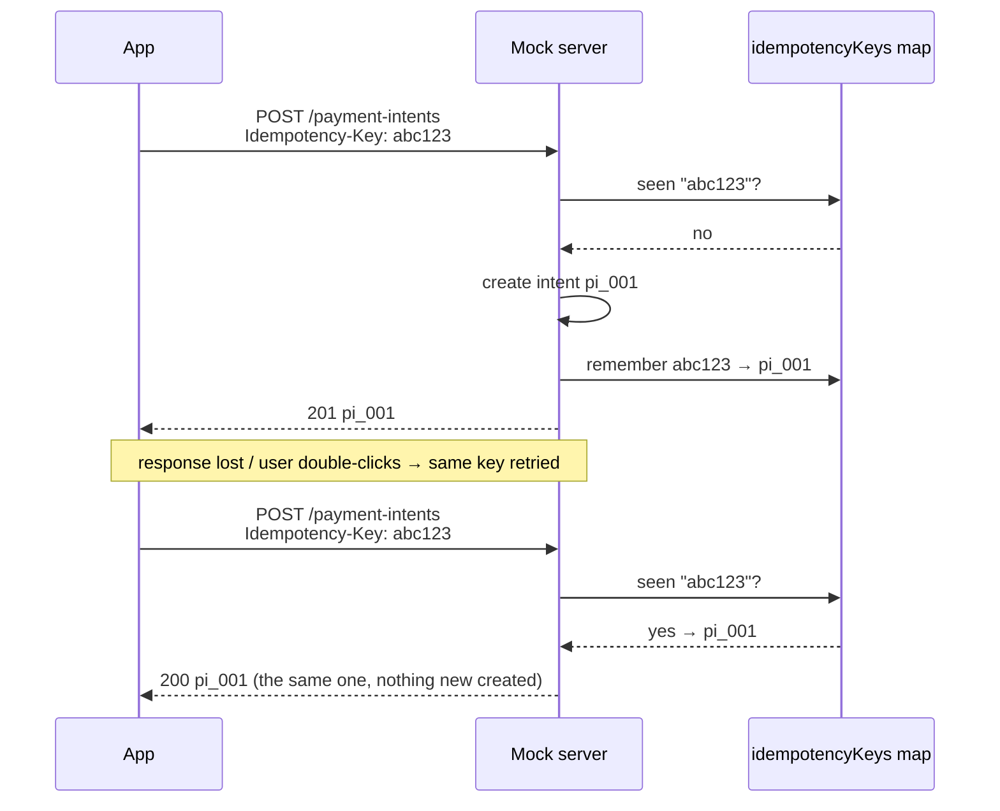
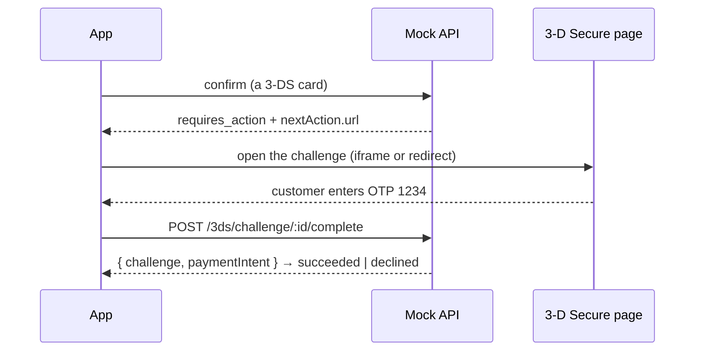

# Mock payment API

> Русская версия: [README.ru.md](./README.ru.md)

A pretend payment backend that runs **inside your browser**. It behaves like a
Stripe-style API — create a charge, confirm a card, walk through 3‑D Secure — but there
is no server. That means you can build and test the whole checkout, including the tricky
bank-authentication step, offline and with zero setup.

It is built on [MSW](https://mswjs.io/) (Mock Service Worker). A service worker sits
between the app and the network and answers the requests itself, so from the app's side
these look like completely ordinary `fetch` calls.

If you only remember one thing: **the app talks to `/api/...` exactly as it would to a
real server; the mock just answers instead of the network.**



---

## Turning it on

The mock only runs in development, and only when you ask for it:

```bash
npm run dev:mock
```

That starts Vite in `mock` mode, which loads `.env.mock` (`VITE_ENABLE_MSW=true`) and
registers the worker in `apps/demo/src/app/enable-mocking.ts`. With plain `npm run dev` or any
production build, none of this code is bundled — requests hit the real network. Anything
the mock doesn't recognise is passed straight through (`onUnhandledRequest: 'bypass'`),
so images, fonts and other traffic are untouched.

**Everything lives in memory and resets on reload.** There is no database; refresh the
page and every intent, key and challenge is gone. That is on purpose — a clean slate for
each test run.

---

## House rules

A few conventions hold across every endpoint:

- **Base path:** everything is under `/api`.
- **Format:** JSON in, JSON out (the one exception is the 3‑D Secure page, which is HTML).
- **Money is in _minor units_.** `4999` means **$49.99**, not $4999. Cents, not dollars.
  This trips people up constantly, so: multiply by 100 when you think in dollars.
- **No auth.** No API keys — this is a local toy.
- **Latency is faked.** Every response waits a random 150–700 ms so the UI has to cope
  with real-world "the network is slow" behaviour (spinners, disabled buttons).
- **Errors always look the same** — one envelope, so the client has one thing to parse:

  ```json
  {
    "error": {
      "type": "invalid_request_error",
      "code": "parameter_missing",
      "message": "…",
      "param": "planId"
    }
  }
  ```

  `type` is one of `invalid_request_error`, `card_error`, `api_error`, `rate_limit_error`.
  `code` and `param` appear when they help.

---

## The two objects you'll meet

### Plan

The catalog of what a customer can buy. **It lives on the server** — the browser never
gets to say what something costs (more on why under [Prices live on the
server](#prices-live-on-the-server-not-the-browser)).

```jsonc
{
  "id": "1id",
  "name": "Monthly",
  "discount": "32%", // optional
  "price": "25/month", // display text
  "amount": 2500, // the real, chargeable price in minor units
  "currency": "USD",
}
```

### Payment intent

One attempt to take money. It's a small state machine — it starts empty and moves
towards a final ("terminal") state as the customer acts.

```jsonc
{
  "id": "pi_a1b2…",
  "object": "payment_intent",
  "amount": 2500,
  "currency": "USD",
  "status": "requires_payment_method",
  "clientSecret": "pi_a1b2…_secret_…",
  "livemode": false,
  "created": 1755705600, // unix seconds
  "nextAction": null, // filled in when status is "requires_action"
  "error": null, // filled in when a card is declined
}
```

Here is the whole life of an intent. Green states are terminal — once reached, nothing
changes:



---

## Prices live on the server, not the browser

This is the single most important idea in this mock, and it mirrors how real payment
APIs work.

**The browser can be tampered with.** Anyone can open dev tools and change what the app
sends. If the client told the server _"charge $25"_, an attacker could quietly change it
to _"charge $0.01"_ and buy the yearly plan for a penny.

So the client never sends a price. It sends a **`planId`** — the _name_ of what they
want — and the server looks up the real price in its own catalog:



Change `planId` in the request and you only change _which_ plan you're buying — you can
never invent a price. An unknown `planId` is simply rejected.

---

## Endpoints

### Catalog, merchant & payment methods

| Method | Path                   | What you get                       |
| ------ | ---------------------- | ---------------------------------- |
| GET    | `/api/plans`           | The plan catalog (array of plans). |
| GET    | `/api/merchant/config` | Merchant name, currency, amount.   |
| GET    | `/api/payment-methods` | Saved test payment methods.        |

`GET /api/plans` is what the checkout page reads to draw the plan cards — so the prices
shown always match the prices the server will charge.

### Payment intents

| Method | Path                               | What it does                           |
| ------ | ---------------------------------- | -------------------------------------- |
| POST   | `/api/payment-intents`             | Start a new charge attempt.            |
| GET    | `/api/payment-intents/:id`         | Read one back (poll its status).       |
| POST   | `/api/payment-intents/:id/confirm` | Hand over a card and see what happens. |
| POST   | `/api/payment-intents/:id/cancel`  | Call off a not-yet-finished attempt.   |

**Create** — body is just `{ planId }`. The server resolves the price itself and returns
`201` with the new intent.

```ts
const res = await fetch('/api/payment-intents', {
  method: 'POST',
  headers: { 'Content-Type': 'application/json', 'Idempotency-Key': crypto.randomUUID() },
  body: JSON.stringify({ planId: '1id' }),
})
const intent = await res.json()
```

Validation: missing `planId` → `400` (`parameter_missing`); a `planId` that isn't in the
catalog → `422` (`parameter_invalid`).

#### Idempotency — making "retry" safe

This is worth understanding properly, because it's where naive payment code goes wrong.

**The problem.** Creating an intent starts money moving, and the network is not
reliable. Three everyday things can make the _same_ request happen twice:

- the request reaches the server but the **response is lost** on the way back, so the app
  thinks it failed and tries again;
- the user **double-clicks** "Pay";
- the app **auto-retries** after a timeout.

Without protection, each of those creates a **brand-new intent** — and the customer gets
charged twice. Not good.

**The fix — an idempotency key.** The client generates one random string per _attempt_
and sends it as the `Idempotency-Key` header. It's like putting a name tag on the
request: _"this is attempt #abc123."_ The server remembers that name. If a request
arrives wearing a name it has already seen, the server doesn't do the work again — it
just hands back the result it produced the first time.



So N identical retries produce **exactly one** intent. In this mock the memory is a
simple `Map<key, intentId>` in `data.ts`; the handler:

1. reads the `Idempotency-Key` header;
2. if the key is already known, returns the **already-created** intent (same id);
3. otherwise creates the intent and records `key → intent.id`.

**The one rule that makes it work: generate the key once _per attempt_, and reuse it
across retries of that attempt.** Do it with `crypto.randomUUID()` when checkout starts —
not on every render, and _not_ fresh on each retry. A retry with a new key looks like a
new attempt and defeats the whole point. When the customer genuinely starts over, _then_
they get a new key.

**Why only create?** `confirm` and `cancel` don't need a key — they're protected a
different way. They act on an intent that already exists, and the state machine won't let
them run twice: confirming or cancelling an intent that's already finished returns `400`
(`payment_intent_unexpected_state`). Idempotency-by-key guards the one operation that
_creates_ something; the state machine guards the rest.

**How real APIs go further** (this mock keeps it simple on purpose): production services
also store the full response body and status code (not just the id), **expire** keys
after ~24h, and return `409 Conflict` if the _same key_ comes back with a _different
body_ (that means a bug — the client reused a name tag for a different request). This
mock only maps `key → intent` and ignores the body on replay.

**Confirm** — body `{ cardNumber }` (spaces are ignored). The card number you send
decides the outcome — see [Test cards](#test-cards). You always get `200` with the
updated intent; the _status_ tells you what happened:

- good card → `status: "succeeded"`
- declined → `status: "declined"` with a filled-in `error` (still HTTP `200` — a decline
  is a normal card answer, not a broken connection)
- needs the bank → `status: "requires_action"` plus a `nextAction` (see 3‑D Secure)
- slow → `status: "processing"` — keep reading `GET /api/payment-intents/:id` until it
  settles

Confirming an intent that's already finished (or waiting on the bank) returns `400`
(`payment_intent_unexpected_state`). Confirming an id that doesn't exist returns `404`
(`resource_missing`).

**Cancel** — moves a not-yet-finished intent to `canceled`; a finished one returns `400`.

### 3‑D Secure

Some cards require an extra "prove it's really you" step with the bank — a code, a
push notification. That's 3‑D Secure, and it's the fiddly part of any checkout.

| Method | Path                                       | What it does                           |
| ------ | ------------------------------------------ | -------------------------------------- |
| GET    | `/api/3ds/challenge/:challengeId`          | The bank's challenge page (HTML/JSON). |
| POST   | `/api/3ds/challenge/:challengeId/complete` | Send the authentication result.        |

When a confirm comes back as `requires_action`, the intent carries the pointer to the
challenge:

```jsonc
"nextAction": {
  "type": "redirect_to_url",
  "three_d_secure": {
    "challengeId": "tdsc_…",
    "url": "/api/3ds/challenge/tdsc_…",
    "status": "pending"
  }
}
```

The whole dance, end to end:



`GET /api/3ds/challenge/:challengeId` returns an HTML screen by default (good for an
iframe or a redirect). Ask with `Accept: application/json` to get the state as JSON
instead.

`POST /api/3ds/challenge/:challengeId/complete` accepts an HTML form field `otp`, or a
JSON body `{ "otp": "1234" }`, or `{ "outcome": "success" | "fail" }`. The test OTP is
**`1234`**. Whether authentication really succeeds is decided by the card, not just the
OTP: a "3DS passes" card can still fail on a wrong OTP; a "3DS fails" card always fails.
On completion the linked intent becomes `succeeded` or `declined`
(`authentication_failed`). A JSON request gets `{ challenge, paymentIntent }`; an HTML
form submit gets a small result page.

---

## Test cards

The mock decides what happens from the **digits of the card number** — so you can force
any outcome on demand.

| Card number           | What happens                                             |
| --------------------- | -------------------------------------------------------- |
| `4242 4242 4242 4242` | Succeeds.                                                |
| `4000 0000 0000 0002` | Declined — `generic_decline`.                            |
| `4000 0000 0000 9995` | Declined — `insufficient_funds`.                         |
| `4000 0000 0000 0069` | Declined — `expired_card`.                               |
| `4000 0000 0000 0127` | Declined — `incorrect_cvc`.                              |
| `4000 0025 0000 3155` | Requires 3‑D Secure; passes when completed (OTP `1234`). |
| `4000 0084 0000 1629` | Requires 3‑D Secure; always fails.                       |
| `4000 0000 0000 9979` | Processing (poll for the final status).                  |
| `4000 0000 0000 0341` | Provider error — responds `503`.                         |
| any other valid card  | Succeeds.                                                |

---

## A typical checkout, start to finish

```ts
// 0. Show the plans (prices come from the server, never hardcoded).
const plans = await getPlans() // GET /api/plans

// 1. Start the attempt. One key for this whole attempt; reuse it on retries.
const idempotencyKey = crypto.randomUUID()
const intent = await createPaymentIntent({ planId: chosenPlanId }, idempotencyKey)

// 2. Confirm with the entered card.
let result = await confirmPaymentIntent(intent.id, cardNumber)

// 3. Branch on the status.
switch (result.status) {
  case 'succeeded':
    // show the receipt
    break
  case 'declined':
    // show result.error.message
    break
  case 'requires_action':
    // open result.nextAction.three_d_secure.url, then re-read the intent:
    result = await getPaymentIntent(intent.id)
    break
  case 'processing':
    // poll getPaymentIntent(intent.id) until it settles
    break
}
```

---

## Where things live

```
packages/testing/src/backend/
  browser.ts          worker setup (setupWorker)
  config.ts           latency bounds, OTP (test cards live in packages/testing)
  data.ts             in-memory stores (plans, intents, idempotency keys, challenges)
  types.ts            request/response and domain types
  lib/
    respond.ts        json() / error() helpers, shared error envelope
    delay.ts          jittered latency
    validation.ts     body parsing and parameter errors
  handlers/
    index.ts          combines all handlers
    plans.ts          GET /api/plans
    merchant.ts
    payment-methods.ts
    payment-intents.ts
    three-ds.ts
```

---

## Adding to it

- **A new endpoint:** drop a handler module under `handlers/`, export an array, and
  spread it into `handlers/index.ts`. Use `json` / `error` from `lib/respond.ts` so
  responses keep the same shape.
- **A new plan:** add an entry to `plans` in `data.ts`. The catalog and the price used
  for charging both read from there, so they can't drift apart.
- **A new test card:** add an entry to `TEST_CARDS` in `packages/testing/src/test-cards.ts`.
  The confirm handler reads its behaviour from there — nothing else changes.

All state lives in memory and resets on reload.

---

## Further reading

- [MSW documentation](https://mswjs.io/docs/)
- [Stripe: the PaymentIntents API](https://docs.stripe.com/payments/payment-intents)
- [Stripe: idempotent requests](https://docs.stripe.com/api/idempotent_requests)
- [Stripe: 3D Secure authentication](https://docs.stripe.com/payments/3d-secure)
- [Iframes and 3‑D Secure in this project](../../docs/iframe.md)
- [Project architecture](../../docs/architecture.md)
