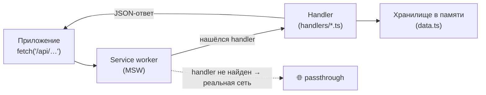
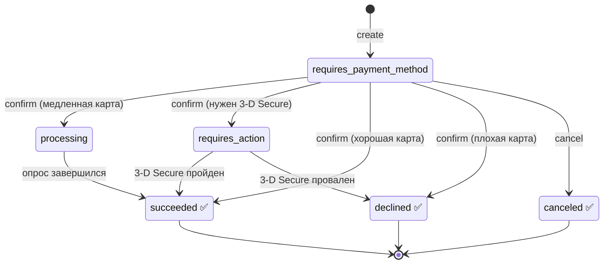
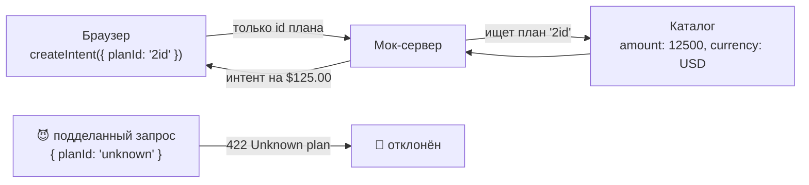
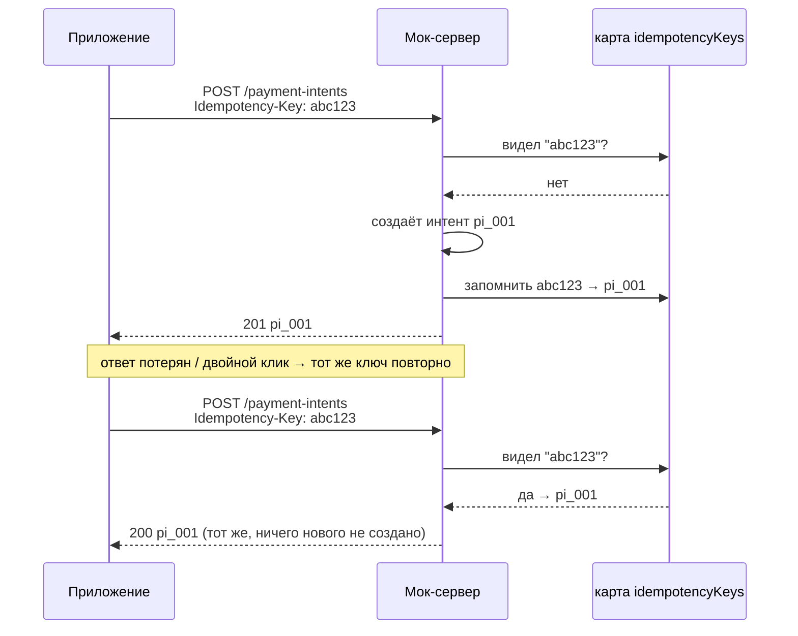
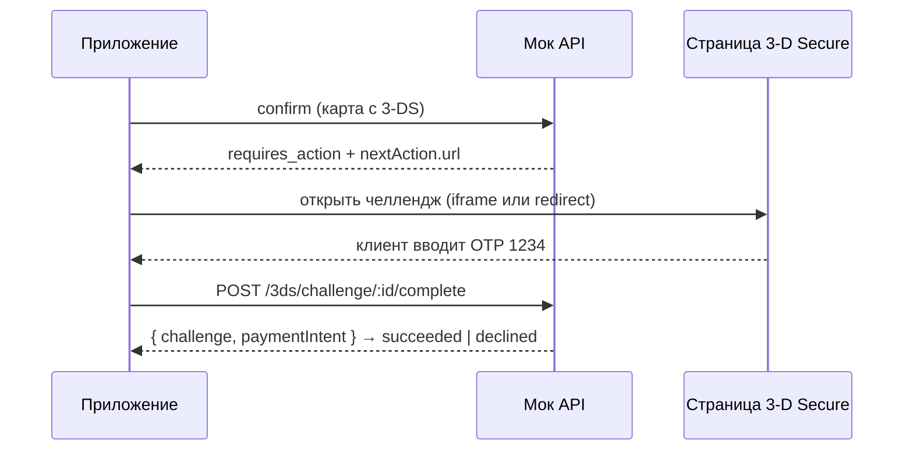

# Мок платёжного API

> English version: [README.md](./README.md)

Это ненастоящий платёжный бэкенд, который работает **прямо в браузере**. Ведёт себя как
API в стиле Stripe — создать платёж, подтвердить карту, пройти 3‑D Secure, — но сервера
нет. Благодаря этому весь чекаут, включая муторный шаг подтверждения в банке, можно
разрабатывать и тестировать офлайн и вообще без настройки.

Построено на [MSW](https://mswjs.io/) (Mock Service Worker). Service worker встаёт между
приложением и сетью и сам отвечает на запросы — так что со стороны приложения это
обычные вызовы `fetch`.

Если запомнить только одно: **приложение обращается к `/api/...` точно так же, как к
настоящему серверу; мок просто отвечает вместо сети.**



---

## Как включить

Мок работает только в разработке и только когда его явно попросили:

```bash
npm run dev:mock
```

Это запускает Vite в режиме `mock`, который грузит `.env.mock` (`VITE_ENABLE_MSW=true`)
и регистрирует worker в `src/app/enable-mocking.ts`. При обычном `npm run dev` или любой
прод-сборке этот код вообще не попадает в бандл — запросы идут в реальную сеть. Всё, что
мок не распознал, проходит насквозь (`onUnhandledRequest: 'bypass'`), поэтому картинки,
шрифты и прочий трафик не затрагиваются.

**Всё живёт в памяти и обнуляется при перезагрузке.** Никакой базы данных: обновил
страницу — и все интенты, ключи и челленджи исчезли. Так задумано — чистый лист на
каждый прогон.

---

## Общие правила

Несколько соглашений действуют на всех эндпоинтах:

- **Базовый путь:** всё под `/api`.
- **Формат:** JSON туда, JSON обратно (единственное исключение — HTML-страница 3‑D
  Secure).
- **Деньги — в _минорных единицах_.** `4999` значит **$49.99**, а не $4999. Центы, не
  доллары. На этом постоянно спотыкаются, поэтому: думаешь в долларах — умножай на 100.
- **Без авторизации.** Никаких API-ключей — это локальная игрушка.
- **Задержка имитируется.** Каждый ответ ждёт случайные 150–700 мс, чтобы UI умел
  переживать реальное «сеть тормозит» (спиннеры, заблокированные кнопки).
- **Ошибки всегда выглядят одинаково** — единый конверт, чтобы клиенту парсить одно:

  ```json
  {
    "error": {
      "type": "invalid_request_error",
      "code": "parameter_missing",
      "message": "…",
      "param": "planId"
    }
  }
  ```

  `type` — один из `invalid_request_error`, `card_error`, `api_error`,
  `rate_limit_error`. `code` и `param` появляются, когда это помогает.

---

## Два объекта, с которыми столкнёшься

### План (Plan)

Каталог того, что клиент может купить. **Живёт на сервере** — браузеру не позволено
диктовать цену (почему — ниже, в разделе [Цены живут на
сервере](#цены-живут-на-сервере-а-не-в-браузере)).

```jsonc
{
  "id": "1id",
  "name": "Monthly",
  "discount": "32%", // опционально
  "price": "25/month", // текст для отображения
  "amount": 2500, // реальная списываемая цена в минорных единицах
  "currency": "USD",
}
```

### Платёжный интент (payment intent)

Одна попытка взять деньги. Это маленький конечный автомат: начинается пустым и движется
к финальному («терминальному») состоянию по мере действий клиента.

```jsonc
{
  "id": "pi_a1b2…",
  "object": "payment_intent",
  "amount": 2500,
  "currency": "USD",
  "status": "requires_payment_method",
  "clientSecret": "pi_a1b2…_secret_…",
  "livemode": false,
  "created": 1755705600, // unix-секунды
  "nextAction": null, // заполняется при статусе "requires_action"
  "error": null, // заполняется, когда карту отклонили
}
```

Вот вся жизнь интента. Зелёные состояния — терминальные: достигнув их, интент больше не
меняется:



---

## Цены живут на сервере, а не в браузере

Это главная идея всего мока, и она повторяет то, как устроены настоящие платёжные API.

**Браузеру нельзя доверять.** Любой может открыть dev tools и изменить то, что шлёт
приложение. Если бы клиент говорил серверу _«спиши $25»_, злоумышленник тихо поменял бы
это на _«спиши $0.01»_ и купил годовой план за копейку.

Поэтому клиент никогда не шлёт цену. Он шлёт **`planId`** — _название_ того, что хочет, —
а сервер сам находит реальную цену в своём каталоге:



Поменяешь `planId` в запросе — изменится только _какой_ план ты покупаешь; выдумать цену
нельзя. Неизвестный `planId` просто отклоняется.

---

## Эндпоинты

### Каталог, мерчант и способы оплаты

| Метод | Путь                   | Что возвращает                    |
| ----- | ---------------------- | --------------------------------- |
| GET   | `/api/plans`           | Каталог планов (массив).          |
| GET   | `/api/merchant/config` | Имя мерчанта, валюта, сумма.      |
| GET   | `/api/payment-methods` | Сохранённые тестовые способы.     |

`GET /api/plans` читает страница чекаута, чтобы нарисовать карточки планов, — поэтому
показанные цены всегда совпадают с тем, что спишет сервер.

### Платёжные интенты

| Метод | Путь                               | Что делает                              |
| ----- | ---------------------------------- | --------------------------------------- |
| POST  | `/api/payment-intents`             | Начать новую попытку оплаты.            |
| GET   | `/api/payment-intents/:id`         | Прочитать интент (опросить статус).     |
| POST  | `/api/payment-intents/:id/confirm` | Передать карту и посмотреть результат.  |
| POST  | `/api/payment-intents/:id/cancel`  | Отменить незавершённую попытку.         |

**Create** — тело просто `{ planId }`. Сервер сам определяет цену и возвращает `201` с
новым интентом.

```ts
const res = await fetch('/api/payment-intents', {
  method: 'POST',
  headers: { 'Content-Type': 'application/json', 'Idempotency-Key': crypto.randomUUID() },
  body: JSON.stringify({ planId: '1id' }),
})
const intent = await res.json()
```

Валидация: нет `planId` → `400` (`parameter_missing`); `planId`, которого нет в каталоге,
→ `422` (`parameter_invalid`).

#### Идемпотентность — как сделать «повтор» безопасным

Это стоит понять как следует — именно здесь наивный платёжный код ломается.

**Проблема.** Создание интента запускает движение денег, а сеть ненадёжна. Три
житейские ситуации приводят к тому, что _один и тот же_ запрос случается дважды:

- запрос дошёл до сервера, но **ответ потерялся** по пути назад — приложение думает, что
  не вышло, и повторяет;
- пользователь **дважды кликнул** «Оплатить»;
- приложение **само повторяет** запрос после таймаута.

Без защиты каждый такой случай создаёт **новый** интент — и клиента спишут дважды. Плохо.

**Решение — ключ идемпотентности.** Клиент генерирует одну случайную строку на _попытку_
и шлёт её в заголовке `Idempotency-Key`. Это как приклеить к запросу бирку: _«это попытка
#abc123»_. Сервер запоминает эту бирку. Если приходит запрос с уже виденной биркой,
сервер не делает работу заново — просто отдаёт результат, который получил в первый раз.



Итого N одинаковых повторов дают **ровно один** интент. В моке память — это простая
`Map<key, intentId>` в `data.ts`; handler:

1. читает заголовок `Idempotency-Key`;
2. если ключ уже известен — возвращает **уже созданный** интент (тот же id);
3. иначе создаёт интент и записывает `key → intent.id`.

**Единственное правило, благодаря которому это работает: генерируй ключ один раз _на
попытку_ и переиспользуй его на всех повторах этой попытки.** Делай это через
`crypto.randomUUID()` в начале чекаута — не на каждый рендер и _не_ заново на каждый
повтор. Повтор со свежим ключом выглядит как новая попытка и убивает весь смысл. Когда
клиент действительно начинает заново — _тогда_ он получает новый ключ.

**Почему только create?** `confirm` и `cancel` ключ не нужен — они защищены иначе. Они
работают с уже существующим интентом, и конечный автомат не даст выполнить их дважды:
подтверждение или отмена уже завершённого интента вернут `400`
(`payment_intent_unexpected_state`). Идемпотентность-по-ключу защищает единственную
операцию, которая что-то _создаёт_; за остальное отвечает автомат состояний.

**Как делают настоящие API** (мок намеренно упрощён): продакшн-сервисы ещё хранят полное
тело ответа и код статуса (не только id), **протухают** ключи через ~24 ч и возвращают
`409 Conflict`, если _тот же ключ_ приходит с _другим телом_ (это значит баг — клиент
переиспользовал бирку для другого запроса). Этот мок лишь сопоставляет `key → intent` и
игнорирует тело при повторе.

**Confirm** — тело `{ cardNumber }` (пробелы игнорируются). Номер карты решает исход —
см. [Тестовые карты](#тестовые-карты). Всегда приходит `200` с обновлённым интентом; что
именно случилось, говорит _статус_:

- хорошая карта → `status: "succeeded"`
- отклонение → `status: "declined"` с заполненным `error` (всё ещё HTTP `200` — отказ
  карты это нормальный ответ, а не разрыв связи)
- нужен банк → `status: "requires_action"` плюс `nextAction` (см. 3‑D Secure)
- медленно → `status: "processing"` — опрашивай `GET /api/payment-intents/:id`, пока не
  завершится

Подтверждение уже завершённого интента (или ждущего банк) вернёт `400`
(`payment_intent_unexpected_state`). Подтверждение несуществующего id вернёт `404`
(`resource_missing`).

**Cancel** — переводит незавершённый интент в `canceled`; завершённый вернёт `400`.

### 3‑D Secure

Некоторые карты требуют дополнительного шага «докажи, что это правда ты» с банком — код,
пуш-уведомление. Это и есть 3‑D Secure, самая хлопотная часть любого чекаута.

| Метод | Путь                                       | Что делает                              |
| ----- | ------------------------------------------ | --------------------------------------- |
| GET   | `/api/3ds/challenge/:challengeId`          | Страница челленджа банка (HTML/JSON).   |
| POST  | `/api/3ds/challenge/:challengeId/complete` | Отправить результат аутентификации.     |

Когда confirm вернул `requires_action`, интент несёт указатель на челлендж:

```jsonc
"nextAction": {
  "type": "redirect_to_url",
  "three_d_secure": {
    "challengeId": "tdsc_…",
    "url": "/api/3ds/challenge/tdsc_…",
    "status": "pending"
  }
}
```

Весь танец от начала до конца:



`GET /api/3ds/challenge/:challengeId` по умолчанию возвращает HTML-экран (годится для
iframe или redirect). С заголовком `Accept: application/json` вернёт состояние в JSON.

`POST /api/3ds/challenge/:challengeId/complete` принимает поле HTML-формы `otp`, либо JSON
`{ "otp": "1234" }`, либо `{ "outcome": "success" | "fail" }`. Тестовый OTP — **`1234`**.
Пройдёт ли аутентификация на самом деле, решает карта, а не только OTP: карта «3DS
проходит» может провалиться на неверном OTP; карта «3DS проваливается» падает всегда. По
завершении связанный интент становится `succeeded` или `declined`
(`authentication_failed`). JSON-запрос получает `{ challenge, paymentIntent }`; отправка
HTML-формы — маленькую страницу результата.

---

## Тестовые карты

Мок решает, что произойдёт, по **цифрам номера карты** — так можно принудительно вызвать
любой исход.

| Номер карты           | Что происходит                                           |
| --------------------- | -------------------------------------------------------- |
| `4242 4242 4242 4242` | Успех.                                                   |
| `4000 0000 0000 0002` | Отказ — `generic_decline`.                               |
| `4000 0000 0000 9995` | Отказ — `insufficient_funds`.                            |
| `4000 0000 0000 0069` | Отказ — `expired_card`.                                  |
| `4000 0000 0000 0127` | Отказ — `incorrect_cvc`.                                 |
| `4000 0025 0000 3155` | Требует 3‑D Secure; проходит при завершении (OTP `1234`).|
| `4000 0084 0000 1629` | Требует 3‑D Secure; всегда проваливается.                |
| `4000 0000 0000 9979` | Processing (опрашивай финальный статус).                 |
| `4000 0000 0000 0341` | Ошибка провайдера — отвечает `503`.                      |
| любая другая валидная | Успех.                                                   |

---

## Типичный чекаут от и до

```ts
// 0. Показать планы (цены приходят с сервера, никогда не захардкожены).
const plans = await getPlans() // GET /api/plans

// 1. Начать попытку. Один ключ на всю попытку; переиспользуем при повторах.
const idempotencyKey = crypto.randomUUID()
const intent = await createPaymentIntent({ planId: chosenPlanId }, idempotencyKey)

// 2. Подтвердить введённой картой.
let result = await confirmPaymentIntent(intent.id, cardNumber)

// 3. Ветвление по статусу.
switch (result.status) {
  case 'succeeded':
    // показать чек
    break
  case 'declined':
    // показать result.error.message
    break
  case 'requires_action':
    // открыть result.nextAction.three_d_secure.url, затем перечитать интент:
    result = await getPaymentIntent(intent.id)
    break
  case 'processing':
    // опрашивать getPaymentIntent(intent.id), пока не завершится
    break
}
```

---

## Где что лежит

```
src/mocks/
  browser.ts          настройка worker (setupWorker)
  config.ts           границы задержки, тестовые карты, OTP
  data.ts             хранилища в памяти (планы, интенты, ключи идемпотентности, челленджи)
  types.ts            типы запросов/ответов и домена
  lib/
    respond.ts        хелперы json() / error(), общий конверт ошибок
    delay.ts          дрожащая задержка
    validation.ts     разбор тела и ошибки параметров
  handlers/
    index.ts          собирает все handlers
    plans.ts          GET /api/plans
    merchant.ts
    payment-methods.ts
    payment-intents.ts
    three-ds.ts
```

---

## Как расширять

- **Новый эндпоинт:** положи модуль-handler в `handlers/`, экспортируй массив и раскрой
  его в `handlers/index.ts`. Используй `json` / `error` из `lib/respond.ts`, чтобы ответы
  сохраняли форму.
- **Новый план:** добавь запись в `plans` в `data.ts`. Каталог и цена для списания читают
  оттуда же — рассинхрониться не смогут.
- **Новая тестовая карта:** добавь запись в `TEST_CARDS` в `config.ts`. Handler confirm
  берёт поведение оттуда — больше ничего менять не нужно.

Всё состояние живёт в памяти и обнуляется при перезагрузке.

---

## Что почитать дальше

- [Документация MSW](https://mswjs.io/docs/)
- [Stripe: PaymentIntents API](https://docs.stripe.com/payments/payment-intents)
- [Stripe: идемпотентные запросы](https://docs.stripe.com/api/idempotent_requests)
- [Stripe: аутентификация 3D Secure](https://docs.stripe.com/payments/3d-secure)
- [Iframe и 3‑D Secure в этом проекте](../../docs/iframe.ru.md)
- [Архитектура проекта](../../docs/architecture.ru.md)
